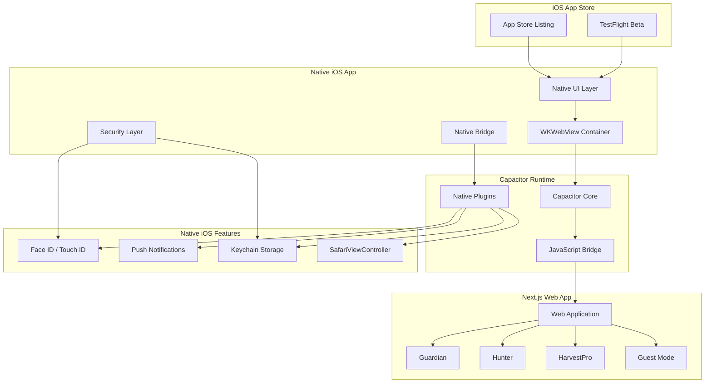

# Design Document

## Overview

This design document outlines the technical architecture for onboarding AlphaWhale's Next.js web application to the Apple App Store using Capacitor as a hybrid mobile framework. The design focuses on creating a native iOS experience while maintaining compliance with Apple's App Store guidelines and leveraging AlphaWhale's security and trust features.

The solution wraps the existing web application in a native iOS container, adds native security features, implements guest mode for App Store compliance, and ensures seamless integration between web and native components.

## Architecture

### High-Level Architecture



### Component Architecture

The application consists of four main layers:

1. **Native iOS Layer**: Handles App Store compliance, native UI elements, and iOS-specific features
2. **Capacitor Runtime**: Provides the bridge between native iOS and web technologies
3. **Web Application Layer**: The existing Next.js application with mobile optimizations
4. **Security & Trust Layer**: Native security features that enhance AlphaWhale's trust moat

## iOS Permission Declarations (Info.plist)

- NSFaceIDUsageDescription: "Enable Face ID to lock AlphaWhale and protect sensitive portfolio insights."
- NSUserTrackingUsageDescription (ONLY if you use tracking): "Used to improve app experience and measure anonymized performance." (If you do not track across apps/sites, do NOT request this permission.)
- Push Notifications: Purpose: deliver Guardian alerts and security notifications.

Rule: Only request permissions you actually use.

## WKWebView Security Hardening

- Disable arbitrary navigation to unknown origins (allowlist)
- Enforce HTTPS and ATS (App Transport Security)
- Use SafariViewController for external links
- Block window.open/popups
- Content Security Policy (CSP) enforced in web app
- Prevent mixed-content loading

## Network & Domain Policy (Allowlist)

The iOS app SHALL only load web content from approved origins:

- https://alphawhale.app
- https://www.alphawhale.app
- https://api.alphawhale.app
- https://supabase.<project-ref>.co (if applicable)

Rules:
- WKWebView navigation is blocked for all non-allowlisted origins.
- All external links MUST open via SafariViewController (no in-WebView navigation).
- App Transport Security (ATS) is enforced (no arbitrary loads).
- Mixed content is blocked (HTTP content inside HTTPS pages).

## Content Security Policy (CSP) Baseline

The Next.js web app SHALL enforce a CSP suitable for WKWebView:

- default-src 'self'
- script-src 'self' 'wasm-unsafe-eval' (ONLY if required)
- connect-src 'self' https://api.alphawhale.app https://*.supabase.co
- img-src 'self' data: https:
- frame-src 'none' (or explicit allowlist)
- object-src 'none'
- base-uri 'self'
- form-action 'self'

Any relaxation MUST be documented and reviewed.

## Deep Link Strategy

- Prefer Universal Links for app routing where possible
- Custom URL schemes used only for controlled return flows
- Safe Mode blocks auto-redirect and background-triggered deep links
- All deep link actions require explicit user tap

## In-App Purchase Enforcement

All digital subscriptions are purchased via Apple In-App Purchase on iOS.
No external purchase links are shown inside the iOS app.

## In-App Purchase Products

Example Product IDs:
- com.alphawhale.pro.monthly
- com.alphawhale.pro.yearly

Entitlements unlocked:
- Real-time Guardian alerts (non-execution)
- Advanced analytics views
- Enhanced notifications and watchlists

No external purchase links are shown inside the iOS app.

## Platform Capability Matrix

| Feature | Web | iOS App |
|---------|-----|---------|
| Wallet Read-Only Analytics | ✅ | ✅ |
| Guardian Alerts | ✅ | ✅ |
| Hunter Insights | ✅ | ✅ (Demo in Guest Mode) |
| HarvestPro Insights | ✅ | ✅ (Preview/Informational Only) |
| Transaction Execution | ❌ | ❌ |
| Auto Deep-Links | ❌ | ❌ |
| Private Key Handling | ❌ | ❌ |

## App Store Description Constraints

The App Store listing SHALL NOT:
- Use words like "trade", "execute", "buy", "sell"
- Imply financial advice
- Reference returns or profits

Approved terms:
- "Monitor"
- "Analyze" 
- "Track"
- "Alerts"
- "Education"

## Apple App Store Guideline Mapping

| Apple Guideline | Risk Area | AlphaWhale Handling |
|-----------------|----------|---------------------|
| 2.3.1 Accurate Metadata | Crypto Misrepresentation | Analytics-only wording, no trading, no custody |
| 3.1.1 In-App Purchases | Monetization | Subscriptions only, no external payments |
| 5.1.1 Privacy | Wallet Data | No private keys collected or transmitted |
| 5.1.2 Data Use | Analytics | Aggregated, anonymized, user-consented |
| 5.2.2 Financial Apps | Crypto Risk | Educational + monitoring only |
| 4.8 Crypto Mining | Prohibited Actions | No mining, no transaction execution |

## Privacy Manifest Traceability

| Data Type | Source | Storage | Purpose | User Control |
|----------|--------|--------|---------|-------------|
| Wallet Address | User Input | Encrypted (Keychain) | Analytics | Delete anytime |
| Alerts | Server Push | Device Only | Notifications | Toggle |
| Usage Metrics | App Events | Anonymized | Product Improvement | Opt-out |

## Guest Mode UX Guarantees

Guest users CAN:
- View demo Guardian alerts
- Explore Hunter opportunities (mock data)
- Read educational insights

Guest users CANNOT:
- Connect wallets
- Trigger deep links
- Receive real alerts
- Access personalized data

Required copy: "This is a demo preview. AlphaWhale does not execute trades or hold funds."

## App Review Notes Template

AlphaWhale is a non-custodial crypto analytics and monitoring application.

- The app does NOT execute trades or transactions.
- The app does NOT store private keys or seed phrases.
- Wallet connections are read-only and optional.
- Guest Mode is fully functional without login.
- All financial actions require user initiation in external wallets.
- AlphaWhale does not provide investment advice. All content is informational only.

If additional clarification is needed, please contact: support@alphawhale.app

## Components and Interfaces

### 1. Capacitor Configuration

**Purpose**: Configure Capacitor to properly wrap the Next.js application for iOS

**Key Components**:
- `capacitor.config.ts`: Main configuration file
- iOS project structure in `ios/` directory
- Native plugin integrations
- Build and sync processes

**Configuration Structure**:
```typescript
interface CapacitorConfig {
  appId: 'com.alphawhale.app';
  appName: 'AlphaWhale';
  webDir: 'out'; // Next.js static export
  server: {
    androidScheme: 'https';
    iosScheme: 'https';
  };
  plugins: {
    SplashScreen: SplashScreenConfig;
    PushNotifications: PushNotificationsConfig;
    Keyboard: KeyboardConfig;
    StatusBar: StatusBarConfig;
  };
}
```

### 2. Native iOS Integration Layer

**Purpose**: Handle iOS-specific functionality and App Store compliance

**Key Components**:
- App icons and splash screens
- iOS permissions and Info.plist configuration
- Native navigation handling
- Deep link management
- Background/foreground state management

**Interface**:
```typescript
interface NativeIOSLayer {
  configureAppIcons(): void;
  setupPermissions(): void;
  handleDeepLinks(url: string): void;
  manageAppState(state: 'background' | 'foreground'): void;
  configureStatusBar(): void;
}
```

### 3. Security & Trust Layer

**Purpose**: Implement native security features that enhance AlphaWhale's trust positioning

**Key Components**:
- Biometric authentication (Face ID/Touch ID)
- App lock functionality
- Safe Mode implementation
- Keychain storage for sensitive data
- External link protection
- Non-custodial enforcement
- App integrity verification

**Non-Custodial Enforcement Rule**:
The native iOS app SHALL NOT:
- Sign transactions
- Broadcast transactions
- Execute swaps, transfers, or approvals
- Store private keys or seed phrases
- Auto-redirect to signing interfaces

All transaction-related actions are:
- Disabled in iOS builds
- Informational only
- Redirected to external wallets via user-initiated actions

All external wallet interactions require explicit, user-initiated taps and confirmation.

**Non-Custodial Feature Flag Enforcement**:
The iOS build MUST include a hard gate that prevents any execution UI or signing flow:

- Compile-time flag: IOS_EXECUTION_DISABLED = true
- Runtime assertion on app launch:
  - if IOS_EXECUTION_DISABLED !== true → block app and log a fatal error

CI MUST run a check that fails builds if:
- Any transaction-signing package is included
- Any "execute" routes/components are enabled for iOS

**App Integrity Verification**:
- Jailbreak detection (best-effort)
- Simulator detection
- Runtime tamper signals
- Logged but non-blocking (App Store safe)

**Interface**:
```typescript
interface SecurityLayer {
  enableBiometricLock(): Promise<boolean>;
  lockApp(): void;
  unlockApp(): Promise<boolean>;
  enterSafeMode(): void;
  exitSafeMode(): void;
  storeSecureData(key: string, value: string): Promise<void>;
  retrieveSecureData(key: string): Promise<string>;
  validateExternalLink(url: string): Promise<boolean>;
  enforceNonCustodialMode(): void;
  checkAppIntegrity(): IntegrityReport;
}

const IOS_EXECUTION_DISABLED = true;
```

### 4. Guest Mode System

**Purpose**: Provide App Store-compliant guest experience without requiring wallet connection

**Key Components**:
- Demo data service
- Guest navigation flow
- Feature preview system
- Upgrade prompts

**Interface**:
```typescript
interface GuestModeSystem {
  initializeGuestMode(): void;
  provideDemoData(): DemoData;
  showFeaturePreviews(): FeaturePreview[];
  promptWalletConnection(): void;
  trackGuestInteractions(event: string): void;
}
```

### 5. Web-Native Bridge

**Purpose**: Enable seamless communication between Next.js web app and native iOS features

**Key Components**:
- Capacitor plugin integrations
- Event handling system
- State synchronization
- Error handling and fallbacks

**Interface**:
```typescript
interface WebNativeBridge {
  invokeNativeFeature(feature: string, params: any): Promise<any>;
  listenToNativeEvents(callback: (event: NativeEvent) => void): void;
  syncWebState(state: WebState): void;
  handleNativeError(error: NativeError): void;
}
```

## Data Models

### App Configuration Model

```typescript
interface AppConfig {
  bundleId: string;
  version: string;
  buildNumber: number;
  displayName: string;
  shortVersion: string;
  supportedOrientations: Orientation[];
  minimumIOSVersion: string;
  privacyManifest: PrivacyManifest;
}
```

### Security Settings Model

```typescript
interface SecuritySettings {
  biometricLockEnabled: boolean;
  appLockTimeout: number; // minutes
  safeModeEnabled: boolean;
  externalLinkWarnings: boolean;
  autoLockOnBackground: boolean;
  nonCustodialModeEnforced: boolean;
  integrityCheckEnabled: boolean;
}
```

### App Integrity Model

```typescript
interface IntegrityReport {
  isJailbroken: boolean;
  isSimulator: boolean;
  hasTamperingSigns: boolean;
  timestamp: number;
  riskLevel: 'low' | 'medium' | 'high';
}
```

### Guest Mode Data Model

```typescript
interface GuestModeData {
  demoWallets: DemoWallet[];
  sampleAlerts: GuardianAlert[];
  marketInsights: MarketInsight[];
  featurePreviews: FeaturePreview[];
  onboardingFlow: OnboardingStep[];
}
```

### Native Event Model

```typescript
interface NativeEvent {
  type: 'biometric' | 'deeplink' | 'background' | 'notification';
  payload: any;
  timestamp: number;
  source: 'ios' | 'capacitor' | 'web';
}
```

## Correctness Properties

*A property is a characteristic or behavior that should hold true across all valid executions of a system—essentially, a formal statement about what the system should do. Properties serve as the bridge between human-readable specifications and machine-verifiable correctness guarantees.*

### Property 1: App Store Compliance Validation
*For any* app submission, the app metadata, functionality, and content should comply with Apple App Store Review Guidelines, ensuring approval without rejection.
**Validates: Requirements 3.1, 3A.1, 3A.2, 3A.3, 3A.4, 3A.5, 3A.6**

### Property 2: Capacitor-Next.js State Consistency
*For any* navigation or state change, the web application state should remain consistent between Capacitor WebView and Next.js routing without full page reloads.
**Validates: Requirements 1A.1, 1A.2, 1A.4, 1A.5**

### Property 3: Guest Mode Accessibility
*For any* new user, the app should provide meaningful functionality and value demonstration without requiring wallet connection or account creation.
**Validates: Requirements 3B.1, 3B.2, 3B.3, 3B.4**

### Property 4: Biometric Security Enforcement
*For any* security-sensitive operation, when biometric authentication is enabled, the system should require successful biometric verification before granting access.
**Validates: Requirements 5A.1, 5A.5**

### Property 5: External Link Safety Validation
*For any* external URL, the system should intercept, validate, and warn users before opening potentially malicious or risky links.
**Validates: Requirements 5B.1, 5B.2, 5B.3, 5B.4**

### Property 6: Native Feature Integration Consistency
*For any* native iOS feature (Face ID, notifications, sharing), the integration should work consistently across all supported iOS versions and device types.
**Validates: Requirements 5.1, 5.2, 5.3, 5.4, 5.5**

### Property 7: Deep Link Handling Reliability
*For any* wallet connection or external deep link, the system should properly handle the return flow and maintain application state.
**Validates: Requirements 1A.3, 2.4**

### Property 8: Safe Mode Protection Effectiveness
*For any* potentially dangerous operation, when Safe Mode is enabled, the system should block external deep links and auto-redirects.
**Validates: Requirements 5A.2**

### Property 9: Keychain Storage Security
*For any* sensitive data, the system should store it securely in iOS Keychain and retrieve it only with proper authentication.
**Validates: Requirements 5A.4, 8.3**

### Property 10: Build Pipeline Reliability
*For any* build process, the CI/CD pipeline should produce consistent, signed builds without regenerating iOS project files unnecessarily.
**Validates: Requirements 9A.1, 9A.2, 9A.3, 9A.4**

### Property 11: Performance Standards Compliance
*For any* user interaction, the app should maintain native-like performance with launch times under 3 seconds and 60fps transitions.
**Validates: Requirements 4.1, 4.2, 4.3**

### Property 12: Privacy Manifest Accuracy
*For any* data collection or privacy-related functionality, the app should accurately declare its privacy practices in the App Store privacy manifest.
**Validates: Requirements 8.1, 8.2, 10A.3**

### Property 13: Crypto Compliance Positioning
*For any* app review or user interaction, the system should clearly communicate its analytics-only, non-custodial positioning.
**Validates: Requirements 3A.1, 3A.2, 3A.3, 3A.4, 3A.5**

### Property 14: Trust Signal Display Consistency
*For any* user viewing app information, the system should consistently display company information, security posture, and protection details.
**Validates: Requirements 10A.1, 10A.2**

### Property 15: Notification System Integration
*For any* Guardian alert or system notification, the native iOS notification system should properly display and handle the notification.
**Validates: Requirements 5A.3, 5.4**

## Error Handling

### Native Integration Errors

**Biometric Authentication Failures**:
- Fallback to passcode authentication
- Clear error messaging for unsupported devices
- Graceful degradation for older iOS versions

**Capacitor Bridge Errors**:
- Retry mechanisms for failed native calls
- Fallback to web-only functionality when native features unavailable
- Comprehensive error logging for debugging

**Deep Link Handling Errors**:
- Validation of deep link formats
- Fallback navigation for malformed links
- State recovery after failed wallet connections

### App Store Compliance Errors

**Review Rejection Scenarios**:
- Automated compliance checking before submission
- Clear documentation of crypto/financial positioning
- Fallback content for restricted regions
- Dynamic feature flags allow disabling crypto-related views in restricted jurisdictions
- Guest Mode remains available globally

**Privacy Manifest Errors**:
- Validation of privacy declarations
- Automated testing of data collection practices
- Clear user consent flows

### Performance and Memory Errors

**Memory Management**:
- Automatic cleanup of WebView resources
- Background task management
- Crash recovery and state restoration

**Network and Connectivity**:
- Offline mode with cached content
- Graceful handling of network failures
- Progressive loading for slow connections

## Testing Strategy

### Dual Testing Approach

The testing strategy employs both unit testing and property-based testing to ensure comprehensive coverage:

**Unit Tests**: Verify specific examples, edge cases, and error conditions
**Property Tests**: Verify universal properties across all inputs

Both approaches are complementary and necessary for comprehensive coverage.

### Property-Based Testing Configuration

Using **fast-check** library for JavaScript/TypeScript property-based testing:
- Minimum 100 iterations per property test
- Each property test references its design document property
- Tag format: **Feature: app-store-onboarding, Property {number}: {property_text}**

### Testing Categories

**Native Integration Testing**:
- Capacitor plugin functionality
- iOS permission handling
- Biometric authentication flows
- Deep link processing

**App Store Compliance Testing**:
- Metadata validation
- Content compliance checking
- Privacy manifest accuracy
- Guest mode functionality

**Security Testing**:
- Keychain storage and retrieval
- Safe Mode effectiveness
- External link validation
- Biometric lock enforcement

**Performance Testing**:
- App launch time measurement
- Memory usage monitoring
- Battery consumption analysis
- Network performance validation

**End-to-End Testing**:
- Complete user journeys
- Wallet connection flows
- Guest to authenticated user transitions
- Cross-feature navigation

### Testing Tools and Frameworks

**Unit Testing**: Jest/Vitest for JavaScript/TypeScript components
**Property Testing**: fast-check for universal property validation
**Native Testing**: XCTest for iOS-specific functionality
**E2E Testing**: Detox or Appium for full app testing
**Performance Testing**: Xcode Instruments for iOS performance analysis

### Continuous Integration Testing

**Pre-submission Validation**:
- Automated App Store compliance checking
- Privacy manifest validation
- Performance benchmarking
- Security vulnerability scanning

**Build Validation**:
- Capacitor sync verification
- iOS project integrity checking
- Code signing validation
- TestFlight upload testing