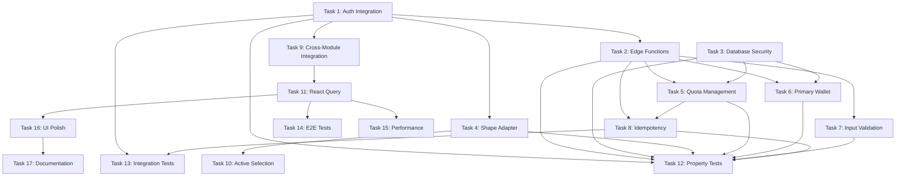

# Multi-Chain EVM Wallet System - Implementation Tasks (v2.4.1)

## TASK OVERVIEW

This document breaks down the implementation of the Multi-Chain EVM Wallet System into discrete, testable tasks. The system is **75% complete** with solid infrastructure - the remaining **25%** focuses on critical auth integration and production hardening.

**Implementation Status**: Infrastructure exists, but auth + server registry + hardening must be connected for production.

---
# Global Instructions (Apply to ALL Tasks Below)

## Goal
For every task listed in this file, ensure the final codebase passes **Vercel deployment**, `npm run build`, and `npm run lint` with **zero ESLint, TypeScript, and Next.js lint errors**.

## Universal Rules
These rules apply to **every task**, regardless of scope:

1. Always run and verify:
   - `npm run lint`
   - `npm run build`
   - Vercel build output (if available)

2. Fix lint issues by **correcting the code**, not by disabling rules.
   - `eslint-disable` is forbidden unless absolutely unavoidable
   - Any exception must include a clear inline justification comment

3. Follow framework best practices:
   - React Hooks must satisfy `react-hooks/exhaustive-deps`
   - Follow Next.js App Router conventions
   - Separate Server and Client components correctly
   - Use `next/image` and `next/link` where required

4. TypeScript rules:
   - No `any` unless strictly required
   - No unused variables or imports
   - All async functions must return correct Promise types

5. Code quality:
   - No `console.log` or debug code
   - No commented-out dead code
   - JSX lists must have stable `key` props
   - No side effects inside render

6. Behavioral constraints:
   - Do NOT change business logic or app behavior
   - Do NOT introduce new dependencies unless required to fix lint issues
   - Refactor only to the extent needed to satisfy lint rules

## Validation Checklist (Required After EACH Task)
- `npm run lint` → ✅ zero errors
- `npm run build` → ✅ success
- Vercel deployment → ✅ no lint failures

## Definition of Done
A task is complete **only if**:
- All lint rules pass
- Build succeeds
- No new warnings are introduced

## TASK CATEGORIES

### 🔴 CRITICAL PATH (Blocks Production)
Tasks that prevent the system from functioning end-to-end in production.

### 🟡 HIGH PRIORITY (Production Hardening) 
Tasks that ensure security, reliability, and compliance.

### 🟢 MEDIUM PRIORITY (Polish & Performance)
Tasks that improve UX and system performance.

### 🔵 LOW PRIORITY (Future Enhancement)
Tasks that can be deferred to future iterations.

---

## PHASE 1: AUTH INTEGRATION & SERVER REGISTRY (CRITICAL PATH)

### Task 1: Auth Flow Integration 🔴
**Priority**: CRITICAL PATH  
**Estimated Effort**: 8 hours  
**Dependencies**: None  
**Validates**: Requirements 2.1, 3.1-3.7, 4.1-4.5

**Description**: Integrate authentication flow with wallet registry hydration to prevent "signin works but modules don't know" bugs.

**Acceptance Criteria**:
- [x] AuthProvider establishes session before WalletProvider hydration
- [x] WalletProvider reads auth session and hydrates from server on user change
- [x] Unauthenticated users redirect to `/login?next=<path>` with validation
- [x] `/signin` aliases to `/login` preserving query parameters
- [x] Zero wallets → `/guardian` with onboarding empty state
- [x] ≥1 wallet → `/guardian` by default
- [x] All modules read from same authenticated WalletContext

**Implementation Steps**:
1. Update `AuthProvider` to establish session state
2. Modify `WalletProvider` to read auth session and trigger hydration
3. Implement route protection with next parameter validation
4. Add `/signin` alias route
5. Update Guardian/Hunter/HarvestPro to read from WalletContext only
6. Add integration tests for auth → wallet hydration flow

**Files to Modify**:
- `src/contexts/AuthProvider.tsx`
- `src/contexts/WalletProvider.tsx` 
- `src/components/ProtectedRoute.tsx`
- `src/pages/signin.tsx` (new)
- `src/pages/Guardian.tsx`
- `src/pages/Hunter.tsx`
- `src/pages/HarvestPro.tsx`

**Testing Requirements**:
- Property test: Auth flow determinism (Property 3)
- Integration test: Sign in → wallet hydration → module access
- E2E test: Complete new user and returning user flows

---

### Task 2: Edge Functions Implementation 🔴
**Priority**: CRITICAL PATH  
**Estimated Effort**: 12 hours  
**Dependencies**: Task 1  
**Validates**: Requirements 13.1-13.5, 20.1-20.7

**Description**: Implement server-authoritative Edge Functions for wallet CRUD operations with two-client authentication pattern.

**Acceptance Criteria**:
- [x] `GET /functions/v1/wallets-list` returns deterministic ordering
- [x] `POST /functions/v1/wallets-add-watch` with ENS resolution and validation
- [x] `POST /functions/v1/wallets-remove` with atomic primary reassignment
- [x] `POST /functions/v1/wallets-remove-address` removes all rows for address
- [x] `POST /functions/v1/wallets-set-primary` with atomic updates
- [x] All functions use JWT validation + service role pattern
- [x] CORS preflight handling for all functions
- [x] Exact API shapes match requirements specification

**Implementation Steps**:
1. Create `supabase/functions/wallets-list/index.ts`
2. Create `supabase/functions/wallets-add-watch/index.ts`
3. Create `supabase/functions/wallets-remove/index.ts`
4. Create `supabase/functions/wallets-remove-address/index.ts`
5. Create `supabase/functions/wallets-set-primary/index.ts`
6. Implement two-client auth pattern in all functions
7. Add CORS handling and error response standardization
8. Deploy and test all Edge Functions

**Files to Create**:
- `supabase/functions/wallets-list/index.ts`
- `supabase/functions/wallets-add-watch/index.ts`
- `supabase/functions/wallets-remove/index.ts`
- `supabase/functions/wallets-remove-address/index.ts`
- `supabase/functions/wallets-set-primary/index.ts`
- `supabase/functions/_shared/auth.ts`
- `supabase/functions/_shared/cors.ts`

**Testing Requirements**:
- Property test: API contract consistency (Property 6)
- Property test: Edge Function security pattern (Property 17)
- Unit tests for each Edge Function
- Integration tests for auth validation and error handling

---

### Task 3: Database Security & Constraints 🔴
**Priority**: CRITICAL PATH  
**Estimated Effort**: 6 hours  
**Dependencies**: None  
**Validates**: Requirements 9.1-9.5, 17.1-17.5, 18.1-18.5

**Description**: Implement database constraints, RLS policies, and migration safety to ensure data integrity and security.

**Acceptance Criteria**:
- [x] `address_lc` generated column for case-insensitive lookups
- [x] Unique constraint on `(user_id, address_lc, chain_namespace)`
- [x] Unique constraint on `(user_id) WHERE is_primary = true`
- [x] RLS policies allow SELECT only for authenticated users
- [x] REVOKE INSERT/UPDATE/DELETE from anon/authenticated roles
- [x] Migration cleanup for existing multiple primaries
- [x] Idempotent migration that's safe to re-run

**Implementation Steps**:
1. Create migration with pre-constraint cleanup logic
2. Add `address_lc` generated column
3. Add unique constraints with proper error handling
4. Implement RLS policies for SELECT-only access
5. REVOKE write permissions from client roles
6. Test migration on copy of production data
7. Verify constraint enforcement with integration tests

**Files to Create**:
- `supabase/migrations/20250106000000_multi_chain_security.sql`
- `scripts/test-migration-safety.sql`

**Testing Requirements**:
- Property test: Database constraint enforcement (Property 5)
- Property test: RLS security enforcement (Property 7)
- Property test: Migration safety and atomicity (Property 20)
- Integration test: Client write operations return 403

---

### Task 4: Wallet Shape Adapter 🔴
**Priority**: CRITICAL PATH  
**Estimated Effort**: 6 hours  
**Dependencies**: Task 2  
**Validates**: Requirements 19.1-19.5

**Description**: Implement database-to-UI shape adapter that groups wallet rows by address for UI consumption.

**Acceptance Criteria**:
- [x] Groups database rows by address (case-insensitive)
- [x] Creates `ConnectedWallet` objects with networks array
- [x] Handles missing wallet-network combinations gracefully
- [x] Prevents duplicate addresses in final array
- [x] Merges guardian scores and balance cache by network
- [x] Preserves original address casing from server

**Implementation Steps**:
1. Implement `adaptWalletRows` function in WalletProvider
2. Add case-insensitive address grouping logic
3. Create `ConnectedWallet` interface and transformation
4. Handle missing combinations with "Not added on this network" UI
5. Merge network-specific data (guardian scores, balances)
6. Add comprehensive unit tests for edge cases

**Files to Modify**:
- `src/contexts/WalletProvider.tsx`
- `src/types/wallet.ts`

**Files to Create**:
- `src/lib/wallet-adapter.ts`
- `src/lib/__tests__/wallet-adapter.test.ts`

**Testing Requirements**:
- Property test: Wallet shape adapter consistency (Property 18)
- Unit tests for grouping logic and edge cases
- Integration test: Database rows → UI shape transformation

---

## PHASE 2: PRODUCTION HARDENING (HIGH PRIORITY)

### Task 5: Quota Management System 🟡
**Priority**: HIGH PRIORITY  
**Estimated Effort**: 8 hours  
**Dependencies**: Task 2, Task 3  
**Validates**: Requirements 7.1-7.8

**Description**: Implement plan-based wallet quota enforcement that counts unique addresses, not rows.

**Acceptance Criteria**:
- [x] Quota counts unique addresses (case-insensitive) per user
- [x] Adding existing address on new network doesn't consume quota
- [x] Adding new address checks quota before insertion
- [x] Returns 409 QUOTA_EXCEEDED when limit reached
- [x] UI displays quota usage (used_addresses, used_rows, total)
- [x] Server-side enforcement in Edge Functions
- [x] Quota response includes plan information

**Implementation Steps**:
1. Add quota calculation logic to `wallets-list` Edge Function
2. Implement quota checking in `wallets-add-watch` Edge Function
3. Create quota display component for UI
4. Add plan-based quota limits configuration
5. Test quota enforcement with property-based tests
6. Add quota exceeded error handling in UI

**Files to Modify**:
- `supabase/functions/wallets-list/index.ts`
- `supabase/functions/wallets-add-watch/index.ts`

**Files to Create**:
- `src/components/wallet/QuotaDisplay.tsx`
- `src/lib/quota.ts`
- `src/lib/__tests__/quota.test.ts`

**Testing Requirements**:
- Property test: Quota enforcement logic (Property 10)
- Unit tests for quota calculation and enforcement
- Integration test: Quota exceeded scenarios

---

### Task 6: Primary Wallet Management 🟡
**Priority**: HIGH PRIORITY  
**Estimated Effort**: 6 hours  
**Dependencies**: Task 2, Task 3  
**Validates**: Requirements 8.1-8.7

**Description**: Implement address-level primary wallet semantics with atomic operations and reassignment logic.

**Acceptance Criteria**:
- [x] Primary is set at address level (one representative row marked)
- [x] Primary selection follows network preference order
- [x] Primary reassignment is atomic with deletion
- [x] First wallet automatically becomes primary
- [x] Only one primary wallet per user enforced
- [x] Primary updates prevent race conditions

**Status**: ✅ COMPLETE - All acceptance criteria met and tested

**Implementation Steps**:
1. Implement primary selection logic in `wallets-set-primary`
2. Add automatic primary assignment for first wallet
3. Implement atomic primary reassignment in `wallets-remove`
4. Add primary preference order (activeNetwork → eip155:1 → oldest)
5. Test concurrent primary operations
6. Add UI feedback for primary wallet status

**Files to Modify**:
- `supabase/functions/wallets-set-primary/index.ts`
- `supabase/functions/wallets-remove/index.ts`
- `supabase/functions/wallets-add-watch/index.ts`

**Files to Create**:
- `src/lib/primary-wallet.ts`
- `src/lib/__tests__/primary-wallet.test.ts`

**Testing Requirements**:
- Property test: Primary wallet semantics (Property 11)
- Unit tests for primary selection and reassignment
- Concurrency tests for atomic operations

---

### Task 7: Input Validation & Security 🟡
**Priority**: HIGH PRIORITY  
**Estimated Effort**: 4 hours  
**Dependencies**: Task 2  
**Validates**: Requirements 5.1-5.5, 10.1-10.5

**Description**: Implement comprehensive input validation to prevent security issues and provide clear error messages.

**Acceptance Criteria**:
- [x] ENS resolution for `.eth` addresses
- [x] Reject private key patterns with PRIVATE_KEY_DETECTED
- [x] Reject seed phrase patterns with SEED_PHRASE_DETECTED
- [x] Validate CAIP-2 chain namespace format
- [x] Return 422 for validation errors with specific codes
- [x] User-friendly error messages in UI
- [x] Rate limiting with 429 responses

**Implementation Steps**:
1. Create input validation utilities
2. Add ENS resolution logic to `wallets-add-watch`
3. Implement private key and seed phrase detection
4. Add CAIP-2 format validation
5. Create error message constants and UI handling
6. Add rate limiting with Upstash Redis
7. Test all validation scenarios

**Files to Create**:
- `src/lib/validation.ts`
- `src/lib/__tests__/validation.test.ts`
- `src/lib/ens-resolver.ts`
- `src/constants/error-messages.ts`

**Files to Modify**:
- `supabase/functions/wallets-add-watch/index.ts`
- `src/components/wallet/AddWalletForm.tsx`

**Testing Requirements**:
- Property test: Input validation security (Property 8)
- Unit tests for all validation patterns
- Integration test: Error handling and user feedback

---

### Task 8: Idempotency & Concurrency 🟡
**Priority**: HIGH PRIORITY  
**Estimated Effort**: 6 hours  
**Dependencies**: Task 2, Task 5  
**Validates**: Requirements 16.1-16.7

**Description**: Implement idempotency and concurrency safety for wallet mutations to handle double-clicks and race conditions.

**Acceptance Criteria**:
- [x] `Idempotency-Key` header support (UUID format, 60s TTL)
- [x] Redis-based idempotency cache (not in-memory)
- [x] Same key within 60s returns cached response
- [x] Database constraints prevent duplicates after TTL expiration
- [x] Atomic operations for primary wallet updates
- [x] Concurrency tests pass consistently

**Implementation Steps**:
1. Add Upstash Redis integration for idempotency cache
2. Implement idempotency middleware for Edge Functions
3. Add `Idempotency-Key` header handling
4. Create atomic transaction wrappers
5. Test concurrent operations and double-click scenarios
6. Add idempotency documentation and examples

**Files to Create**:
- `supabase/functions/_shared/idempotency.ts`
- `supabase/functions/_shared/redis.ts`
- `src/lib/__tests__/concurrency.test.ts`

**Files to Modify**:
- `supabase/functions/wallets-add-watch/index.ts`
- `supabase/functions/wallets-set-primary/index.ts`

**Testing Requirements**:
- Property test: Idempotency behavior (Property 14)
- Concurrency tests for race conditions
- Integration test: Double-click and rapid requests

---

## PHASE 3: INTEGRATION & CONSISTENCY (MEDIUM PRIORITY)

### Task 9: Cross-Module Integration 🟢
**Priority**: MEDIUM PRIORITY  
**Estimated Effort**: 8 hours  
**Dependencies**: Task 1, Task 4  
**Validates**: Requirements 4.1-4.5, 6.5

**Description**: Ensure all modules (Guardian/Hunter/HarvestPro) read from authenticated WalletContext and maintain session consistency.

**Acceptance Criteria**:
- [ ] Guardian reads wallet state only from WalletContext
- [ ] Hunter reads wallet state only from WalletContext  
- [ ] HarvestPro reads wallet state only from WalletContext
- [ ] No modules maintain independent wallet lists when authenticated
- [ ] Wallet/network changes reflect immediately across modules
- [ ] React Query invalidation triggers cross-module updates

**Implementation Steps**:
1. Audit Guardian module for independent wallet state
2. Audit Hunter module for wagmi direct usage
3. Audit HarvestPro module for localStorage wallet usage
4. Remove demo mode fallbacks when authenticated
5. Implement React Query invalidation on wallet changes
6. Add cross-module integration tests

**Files to Modify**:
- `src/pages/Guardian.tsx`
- `src/pages/Hunter.tsx`
- `src/pages/HarvestPro.tsx`
- `src/hooks/useGuardianData.ts`
- `src/hooks/useHunterData.ts`
- `src/hooks/useHarvestProData.ts`

**Testing Requirements**:
- Property test: Cross-module session consistency (Property 9)
- Integration test: Wallet change propagation across modules
- E2E test: Multi-module user journey

---

### Task 10: Active Selection & State Restoration 🟢
**Priority**: MEDIUM PRIORITY  
**Estimated Effort**: 6 hours  
**Dependencies**: Task 4  
**Validates**: Requirements 15.1-15.7, 6.1-6.5

**Description**: Implement deterministic active selection restoration and network switching that preserves wallet selection.

**Acceptance Criteria**:
- [ ] Deterministic ordering: `is_primary DESC, created_at DESC, id ASC`
- [ ] Active selection restoration: localStorage → primary → ordered-first
- [ ] Network switching preserves active wallet address
- [ ] Invalid localStorage selection self-heals
- [ ] Missing wallet-network combinations show "Not added" UI
- [ ] Network switching completes within 2 seconds (P95)

**Implementation Steps**:
1. Implement deterministic ordering in `wallets-list` Edge Function
2. Add active selection restoration logic to WalletProvider
3. Implement localStorage validation and self-healing
4. Add network switching with wallet preservation
5. Create "Not added on this network" UI component
6. Add performance monitoring for network switches

**Files to Modify**:
- `supabase/functions/wallets-list/index.ts`
- `src/contexts/WalletProvider.tsx`
- `src/components/wallet/WalletSelector.tsx`

**Files to Create**:
- `src/components/wallet/NotAddedOnNetwork.tsx`
- `src/lib/__tests__/active-selection.test.ts`

**Testing Requirements**:
- Property test: Active selection network invariance (Property 4)
- Property test: Active selection restoration (Property 16)
- Performance test: Network switching under 2 seconds
- Unit test: localStorage validation and self-healing

---

### Task 11: React Query Integration 🟢
**Priority**: MEDIUM PRIORITY  
**Estimated Effort**: 4 hours  
**Dependencies**: Task 9  
**Validates**: Module Integration Contract

**Description**: Standardize React Query keys and invalidation patterns for cross-module consistency.

**Acceptance Criteria**:
- [ ] Standardized query keys: `['wallets', 'registry']`, `['guardian', activeWallet, activeNetwork]`
- [ ] Wallet mutations invalidate all relevant queries
- [ ] Network switches trigger automatic refetch via key changes
- [ ] Query invalidation is primary mechanism (events secondary)
- [ ] Consistent caching and stale time configuration

**Implementation Steps**:
1. Define standardized query key patterns
2. Update all modules to use consistent query keys
3. Implement query invalidation on wallet mutations
4. Add query key utilities and constants
5. Test query invalidation and refetch behavior
6. Document React Query integration patterns

**Files to Create**:
- `src/lib/query-keys.ts`
- `src/lib/__tests__/query-integration.test.ts`

**Files to Modify**:
- `src/contexts/WalletProvider.tsx`
- `src/hooks/useGuardianData.ts`
- `src/hooks/useHunterData.ts`
- `src/hooks/useHarvestProData.ts`

**Testing Requirements**:
- Integration test: Query invalidation on wallet changes
- Integration test: Network switch triggers refetch
- Unit test: Query key consistency

---

## PHASE 4: TESTING & VALIDATION (MEDIUM PRIORITY)

### Task 12: Property-Based Test Suite 🟢
**Priority**: MEDIUM PRIORITY  
**Estimated Effort**: 12 hours  
**Dependencies**: Tasks 1-8  
**Validates**: All 20 Correctness Properties

**Description**: Implement comprehensive property-based test suite covering all 20 correctness properties with fast-check.

**Acceptance Criteria**:
- [ ] All 20 properties have corresponding property tests
- [ ] Tests use fast-check with minimum 100 iterations
- [ ] Critical properties (auth, database) use 1000 iterations
- [ ] Proper test tagging: `Feature: multi-chain-wallet-system, Property X`
- [ ] Smart generators for valid input spaces
- [ ] Property tests run in CI/CD pipeline

**Implementation Steps**:
1. Create property test files for each major component
2. Implement generators for wallet data, addresses, networks
3. Write property tests for all 20 correctness properties
4. Add property test configuration and CI integration
5. Create property test documentation and examples
6. Validate property test coverage and effectiveness

**Files to Create**:
- `src/lib/__tests__/properties/caip2-format.property.test.ts`
- `src/lib/__tests__/properties/wallet-registry.property.test.ts`
- `src/lib/__tests__/properties/auth-flow.property.test.ts`
- `src/lib/__tests__/properties/active-selection.property.test.ts`
- `src/lib/__tests__/properties/database-constraints.property.test.ts`
- `src/lib/__tests__/properties/api-contracts.property.test.ts`
- `src/lib/__tests__/properties/rls-security.property.test.ts`
- `src/lib/__tests__/properties/input-validation.property.test.ts`
- `src/lib/__tests__/properties/cross-module.property.test.ts`
- `src/lib/__tests__/properties/quota-enforcement.property.test.ts`
- `src/lib/__tests__/generators/wallet-generators.ts`

**Testing Requirements**:
- All 20 properties must pass consistently
- Property tests must run in under 30 seconds total
- Generators must produce valid input distributions

---

### Task 13: Integration Test Suite 🟢
**Priority**: MEDIUM PRIORITY  
**Estimated Effort**: 8 hours  
**Dependencies**: Tasks 1-8  
**Validates**: Critical user flows and error scenarios

**Description**: Implement integration tests for critical user flows, error handling, and cross-component interactions.

**Acceptance Criteria**:
- [ ] Auth → wallet hydration → module access flow
- [ ] Wallet mutation → state update → UI refresh flow
- [ ] Network switch → data isolation → UI update flow
- [ ] Error recovery → fallback behavior → user feedback
- [ ] Edge Function integration with database operations
- [ ] CORS and preflight request handling

**Implementation Steps**:
1. Create integration test setup with test database
2. Implement auth flow integration tests
3. Add wallet mutation and state update tests
4. Create network switching and data isolation tests
5. Add error scenario and recovery tests
6. Test Edge Function integration end-to-end

**Files to Create**:
- `src/__tests__/integration/auth-wallet-flow.test.ts`
- `src/__tests__/integration/wallet-mutations.test.ts`
- `src/__tests__/integration/network-switching.test.ts`
- `src/__tests__/integration/error-recovery.test.ts`
- `src/__tests__/integration/edge-functions.test.ts`
- `src/__tests__/setup/test-database.ts`

**Testing Requirements**:
- Integration tests must use isolated test database
- Tests must clean up state between runs
- Error scenarios must be thoroughly covered

---

### Task 14: End-to-End Test Suite 🟢
**Priority**: MEDIUM PRIORITY  
**Estimated Effort**: 10 hours  
**Dependencies**: Tasks 1-11  
**Validates**: Complete user journeys and browser compatibility

**Description**: Implement E2E tests for complete user journeys using Playwright, covering new user onboarding, returning user flows, and multi-network operations.

**Acceptance Criteria**:
- [ ] New user: Sign up → add wallet → access Guardian
- [ ] Returning user: Sign in → hydrate wallets → continue session
- [ ] Multi-network: Switch networks → verify data isolation
- [ ] Error scenarios: Network failures → fallback behavior
- [ ] Browser compatibility: Chrome, Firefox, Safari
- [ ] Mobile responsiveness: Wallet operations on mobile

**Implementation Steps**:
1. Set up Playwright test environment
2. Create user journey test scenarios
3. Implement new user onboarding E2E tests
4. Add returning user session restoration tests
5. Create multi-network operation tests
6. Add error scenario and fallback tests
7. Test browser compatibility and mobile responsiveness

**Files to Create**:
- `tests/e2e/new-user-journey.spec.ts`
- `tests/e2e/returning-user-flow.spec.ts`
- `tests/e2e/multi-network-operations.spec.ts`
- `tests/e2e/error-scenarios.spec.ts`
- `tests/e2e/browser-compatibility.spec.ts`
- `tests/e2e/mobile-responsiveness.spec.ts`

**Testing Requirements**:
- E2E tests must run against staging environment
- Tests must handle async operations and loading states
- Mobile tests must cover touch interactions

---

## PHASE 5: PERFORMANCE & POLISH (LOW PRIORITY)

### Task 15: Performance Optimization 🔵
**Priority**: LOW PRIORITY  
**Estimated Effort**: 6 hours  
**Dependencies**: Tasks 1-11  
**Validates**: Requirements 11.1-11.5

**Description**: Optimize system performance to meet response time requirements and improve user experience.

**Acceptance Criteria**:
- [ ] Network switching P95 ≤ 2 seconds
- [ ] Database queries use efficient indexes
- [ ] ENS resolution results cached for 10 minutes
- [ ] Rate limiting at 10/min per user for mutations
- [ ] Performance monitoring and alerting

**Implementation Steps**:
1. Add database indexes for efficient lookups
2. Implement ENS resolution caching
3. Add performance monitoring and metrics
4. Optimize network switching operations
5. Add rate limiting configuration
6. Create performance dashboards

**Files to Create**:
- `supabase/migrations/20250107000000_performance_indexes.sql`
- `src/lib/performance-monitor.ts`
- `src/lib/ens-cache.ts`

**Files to Modify**:
- `supabase/functions/wallets-add-watch/index.ts`
- `src/contexts/WalletProvider.tsx`

**Testing Requirements**:
- Performance tests for network switching
- Load tests for Edge Functions
- Cache effectiveness measurements

---

### Task 16: UI/UX Polish 🔵
**Priority**: LOW PRIORITY  
**Estimated Effort**: 8 hours  
**Dependencies**: Tasks 1-11  
**Validates**: User experience requirements

**Description**: Polish user interface and experience for wallet management operations.

**Acceptance Criteria**:
- [ ] Loading states for all async operations
- [ ] Error messages are user-friendly and actionable
- [ ] Success feedback for wallet operations
- [ ] Keyboard navigation support
- [ ] Accessibility compliance (WCAG 2.1 AA)
- [ ] Mobile-responsive design

**Implementation Steps**:
1. Add loading skeletons for wallet operations
2. Improve error message design and content
3. Add success notifications and feedback
4. Implement keyboard navigation
5. Audit and fix accessibility issues
6. Test mobile responsiveness

**Files to Create**:
- `src/components/wallet/WalletLoadingSkeleton.tsx`
- `src/components/wallet/WalletErrorMessage.tsx`
- `src/components/wallet/WalletSuccessNotification.tsx`

**Files to Modify**:
- `src/components/wallet/WalletSelector.tsx`
- `src/components/wallet/AddWalletForm.tsx`
- `src/components/wallet/NetworkBadge.tsx`

**Testing Requirements**:
- Accessibility tests with axe-core
- Mobile responsiveness tests
- Keyboard navigation tests

---

### Task 17: Documentation & Monitoring 🔵
**Priority**: LOW PRIORITY  
**Estimated Effort**: 4 hours  
**Dependencies**: Tasks 1-16  
**Validates**: Operational requirements

**Description**: Create comprehensive documentation and monitoring for the multi-chain wallet system.

**Acceptance Criteria**:
- [ ] API documentation for all Edge Functions
- [ ] Integration guide for developers
- [ ] Troubleshooting guide for common issues
- [ ] Monitoring dashboards for system health
- [ ] Error tracking and alerting
- [ ] Performance metrics collection

**Implementation Steps**:
1. Create API documentation with examples
2. Write developer integration guide
3. Create troubleshooting documentation
4. Set up monitoring dashboards
5. Configure error tracking and alerts
6. Add performance metrics collection

**Files to Create**:
- `docs/api/edge-functions.md`
- `docs/integration-guide.md`
- `docs/troubleshooting.md`
- `docs/monitoring-setup.md`

**Testing Requirements**:
- Documentation accuracy verification
- Monitoring alert testing
- Performance metric validation

---

## TASK DEPENDENCIES

---

## IMPLEMENTATION STRATEGY

### Phase 1: Critical Path (Week 1)
Focus on getting the system functional end-to-end:
- **Day 1-2**: Task 1 (Auth Integration)
- **Day 3-4**: Task 2 (Edge Functions) 
- **Day 5**: Task 3 (Database Security)
- **Weekend**: Task 4 (Shape Adapter)

### Phase 2: Production Hardening (Week 2)
Ensure system is production-ready:
- **Day 1-2**: Task 5 (Quota Management) + Task 6 (Primary Wallet)
- **Day 3**: Task 7 (Input Validation)
- **Day 4-5**: Task 8 (Idempotency & Concurrency)

### Phase 3: Integration & Testing (Week 3)
Ensure system works cohesively:
- **Day 1-2**: Task 9 (Cross-Module Integration)
- **Day 3**: Task 10 (Active Selection) + Task 11 (React Query)
- **Day 4-5**: Task 12 (Property Tests) + Task 13 (Integration Tests)

### Phase 4: Validation & Polish (Week 4)
Final validation and user experience:
- **Day 1-2**: Task 14 (E2E Tests)
- **Day 3**: Task 15 (Performance) + Task 16 (UI Polish)
- **Day 4-5**: Task 17 (Documentation) + Final testing

---

## RISK MITIGATION

### High-Risk Areas
1. **Auth Integration Complexity**: Start with Task 1 early, test thoroughly
2. **Database Migration Safety**: Test Task 3 on production data copy
3. **Edge Function Security**: Implement Task 2 with security review
4. **Cross-Module Consistency**: Validate Task 9 with integration tests

### Rollback Plans
- **Feature Flags**: Enable gradual rollout and quick rollback
- **Database Rollback**: Maintain rollback scripts for migrations
- **Component Fallback**: Keep existing components as fallback
- **Monitoring**: Set up alerts for system health metrics

### Testing Strategy
- **Property-Based Testing**: Primary validation method for correctness
- **Integration Testing**: Validate component interactions
- **E2E Testing**: Ensure complete user journeys work
- **Performance Testing**: Validate response time requirements

---

## SUCCESS CRITERIA

### Functional Requirements
- [ ] All 20 requirements have corresponding acceptance criteria met
- [ ] All 20 correctness properties pass property-based tests
- [ ] Complete user journeys work end-to-end
- [ ] System handles error scenarios gracefully

### Performance Requirements
- [ ] Network switching P95 ≤ 2 seconds
- [ ] Edge Function response times within SLA
- [ ] Database queries use efficient indexes
- [ ] Rate limiting prevents abuse

### Security Requirements
- [ ] RLS policies prevent unauthorized access
- [ ] Input validation prevents security issues
- [ ] Edge Functions use secure authentication
- [ ] Database constraints prevent data corruption

### Quality Requirements
- [ ] Property-based test coverage for all critical properties
- [ ] Integration test coverage for all user flows
- [ ] E2E test coverage for complete journeys
- [ ] Documentation complete and accurate

---

## COMPLETION CHECKLIST

### Phase 1 Complete ✅
- [ ] Users can sign in and wallets hydrate from server
- [ ] Edge Functions handle wallet CRUD operations
- [ ] Database constraints prevent data corruption
- [ ] UI displays wallets grouped by address

### Phase 2 Complete ✅
- [ ] Quota enforcement prevents plan limit violations
- [ ] Primary wallet management works atomically
- [ ] Input validation prevents security issues
- [ ] Idempotency prevents duplicate operations

### Phase 3 Complete ✅
- [ ] All modules read from same wallet context
- [ ] Active selection restores consistently
- [ ] React Query invalidation works cross-module
- [ ] Property-based tests validate correctness

### Phase 4 Complete ✅
- [ ] Integration tests validate component interactions
- [ ] E2E tests validate complete user journeys
- [ ] Performance meets response time requirements
- [ ] UI/UX provides excellent user experience

### Production Ready ✅
- [ ] All tests pass consistently
- [ ] Documentation is complete
- [ ] Monitoring and alerting configured
- [ ] Security review completed
- [ ] Performance benchmarks met

---

This task breakdown provides a clear path from the current 75% complete infrastructure to a production-ready multi-chain wallet system that prevents common integration bugs and provides excellent user experience.