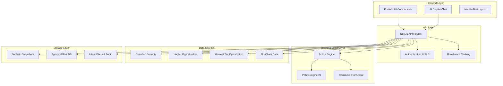

# Design Document: Unified Portfolio System

## Overview

The Unified Portfolio System transforms AlphaWhale's read-only portfolio tracking into a comprehensive "Wealth OS" that provides actionable insights, deterministic safety, and unified orchestration across Guardian (security), Hunter (opportunities), and Harvest (tax optimization) systems. The design emphasizes mobile-first responsive interfaces, reuse of existing infrastructure, and enterprise-grade security with property-based testing for correctness guarantees.

### Core Design Principles

1. **Reuse-First Architecture**: Leverage existing Portfolio routes, components, hooks, and services to prevent duplication and maintain consistency
2. **Mobile-First Responsive**: Single-column layouts for mobile with progressive enhancement for larger screens
3. **Deterministic Safety**: All transaction execution must be simulated and verified before wallet signing
4. **Progressive Disclosure**: Show essential information first with "View all" options for detailed data
5. **Unified Risk Assessment**: Aggregate security scores and risk metrics across all connected systems

## Architecture

### System Architecture Overview



### Component Hierarchy

The design reuses existing Portfolio infrastructure while adding new capabilities:

```
Portfolio Route (/portfolio → /lite/portfolio alias)
├── AI Hub (persistent, always visible)
├── 3-Tab Spine
│   ├── Overview Tab
│   │   ├── Net Worth Card (freshness + confidence)
│   │   ├── Recommended Actions Feed (top 5)
│   │   ├── Risk Summary Card
│   │   └── Recent Activity Timeline
│   ├── Positions Tab
│   │   ├── Asset Breakdown (progressive disclosure)
│   │   ├── Chain Distribution
│   │   ├── Protocol Exposure
│   │   └── Performance Metrics
│   └── Audit Tab
│       ├── Transaction Timeline (AI tags)
│       ├── Approvals Risk List (VAR + severity)
│       ├── Graph-Lite Visualizer
│       └── Planned vs Executed Receipts
└── Copilot Chat Drawer (always available)
```

## Components and Interfaces

### Shared Types

```typescript
type ScopeMode = 'active_wallet' | 'all_wallets';

type WalletScope =
  | { mode: 'active_wallet'; address: `0x${string}` }
  | { mode: 'all_wallets' };
```

### Core UI Components (Reuse Existing)

**Existing Components to Leverage:**
- `src/components/portfolio/*` - Base portfolio components
- `src/components/ux/PortfolioEmptyState.tsx` - Empty states
- `src/hooks/useEnhancedPortfolio.ts` - Portfolio data fetching
- `src/hooks/useUserAddresses.ts` - Multi-wallet management
- `src/services/MetricsService.ts` - Portfolio metrics tracking

## Reuse Audit Gate (MANDATORY)

Before adding any new Portfolio component/hook/store/service/table:

- **Search paths:**
  - `src/components/portfolio/**`
  - `src/hooks/**`
  - `src/stores/**`
  - `src/services/**`
  - `supabase/migrations/**` (tables, enums)
- **Document (≤3 bullets) why reuse/refactor is not possible**
- **If similar exists, prefer:**
  1. Extend existing component/hook
  2. Refactor shared primitive
  3. Only then create new

**Naming rule:** New Portfolio primitives MUST be colocated under existing portfolio folders (no new "portfolio2", "portfolio_vNext" namespaces).

**Components to Extend (or Create ONLY if Missing):**

#### 1. PortfolioHub Component
```typescript
interface PortfolioHubProps {
  wallets: WalletProfile[];
  activeWallet: string;
  onWalletSwitch: (walletId: string) => void;
  freshness: FreshnessConfidence;
}
```

#### 2. RecommendedActionsFeed Component
```typescript
interface RecommendedAction {
  id: string;
  title: string;
  severity: 'critical' | 'high' | 'medium' | 'low';
  why: string[];
  impactPreview: {
    riskDelta: number;
    preventedLossP50Usd: number;
    expectedGainUsd: number;
    gasEstimateUsd: number;
    timeEstimateSec: number;
    confidence: number;
  };
  actionScore: number;
  cta: {
    label: string;
    intent: string;
    params: Record<string, any>;
  };
  walletScope: WalletScope;
}
```

#### 3. ApprovalRiskCard Component
```typescript
interface ApprovalRisk {
  id: string;
  token: string;
  spender: string;
  amount: string; // "unlimited" or specific amount
  riskScore: number;
  severity: 'critical' | 'high' | 'medium' | 'low';
  valueAtRisk: number;
  riskReasons: string[];
  contributingFactors: Array<{
    factor: string;
    weight: number;
    description: string;
  }>;
  ageInDays: number;
  isPermit2: boolean;
}
```

#### 4. IntentPlanExecutor Component
```typescript
interface IntentPlan {
  id: string;
  intent: string;
  steps: ExecutionStep[];
  policy: {
    status: 'allowed' | 'blocked';
    violations: string[];
  };
  simulation: {
    status: 'pass' | 'warn' | 'block';
    receiptId: string;
  };
  impactPreview: {
    gasEstimateUsd: number;
    timeEstimateSec: number;
    riskDelta: number;
  };
  walletScope: WalletScope;
  idempotencyKey: string;
}

interface ExecutionStep {
  stepId: string;
  kind: 'revoke' | 'approve' | 'swap' | 'transfer';
  chainId: number; // Ship Blocker 2: Use chainId: number instead of chain: string
  target: string;
  status: 'pending' | 'simulated' | 'blocked' | 'ready' | 'signing' | 'submitted' | 'confirmed' | 'failed';
  payload?: string;
  gasEstimate?: number;
  error?: string;
}
```

### API Interfaces

#### Freshness and Confidence Contract
```typescript
interface FreshnessConfidence {
  freshnessSec: number;
  confidence: number; // 0.50..1.00
  confidenceThreshold: number; // default 0.70, min 0.50
  degraded: boolean;
  degradedReasons?: string[];
}
```

**UI Rule:** If `degraded=true`, gate risky CTAs (approve/spend/execute) unless user explicitly selects "Override (unsafe)".

#### Copilot SSE Contract
```typescript
// GET /api/v1/portfolio/copilot/stream?wallet=0x...
// SSE events: message, action_card, intent_plan, capability_notice, done
type CopilotStreamEvent =
  | { type: 'message'; text: string }
  | { type: 'action_card'; payload: ActionCard }
  | { type: 'intent_plan'; payload: IntentPlan }
  | { type: 'capability_notice'; payload: { code: string; message: string } }
  | { type: 'done' };

// Rule: on wallet switch, client MUST close SSE, clear stream state, and restart with new walletScope
```

#### Portfolio Snapshot API
```typescript
interface PortfolioSnapshot {
  userId: string;
  netWorth: number;
  delta24h: number;
  freshness: FreshnessConfidence;
  positions: Position[];
  approvals: ApprovalRisk[];
  recommendedActions: RecommendedAction[];
  riskSummary: {
    overallScore: number;
    criticalIssues: number;
    highRiskApprovals: number;
    exposureByChain: Record<string, number>;
  };
  lastUpdated: string;
}
```

#### API Endpoints

```typescript
// Generic list response type
type ListResponse<T> = {
  items: T[];
  nextCursor?: string;
  freshness: FreshnessConfidence; // applies to the list as a whole
};

// Portfolio snapshot
GET /api/v1/portfolio/snapshot?scope=active_wallet|all_wallets&wallet=0x...
-> PortfolioSnapshot

// Approvals
GET /api/v1/portfolio/approvals?scope=...&wallet=...&cursor=...
-> ListResponse<ApprovalRisk>

// Actions
GET /api/v1/portfolio/actions?scope=...&wallet=...
-> { items: RecommendedAction[]; freshness: FreshnessConfidence }

// Plan management
POST /api/v1/portfolio/plan -> IntentPlan
POST /api/v1/portfolio/plan/:id/simulate -> SimulationReceipt + PreFlightCard
POST /api/v1/portfolio/plan/:id/execute
Headers: Idempotency-Key -> { stepStates: ExecutionStep[] }
```

#### Action Engine API
```typescript
interface ActionEngineRequest {
  intent: string;
  walletScope: WalletScope;
  params: Record<string, any>;
  idempotencyKey: string;
}

interface ActionEngineResponse {
  planId: string;
  steps: ExecutionStep[];
  policyCheck: {
    allowed: boolean;
    violations: string[];
    appliedPolicies: string[];
  };
  simulationResult: {
    success: boolean;
    receiptId: string;
    assetDeltas: AssetDelta[];
    permissionDeltas: PermissionDelta[];
    warnings: string[];
  };
  preFlightCard: PreFlightCard;
}
```

### Policy Engine v0 Configuration

```typescript
interface PolicyEngineConfig {
  maxGasUsd: number; // user configurable, default 50
  blockNewContractsDays: number; // default 7
  blockInfiniteApprovalsToUnknown: boolean; // default true
  requireSimulationForValueOverUsd: number; // default 250
  confidenceThreshold: number; // default 0.70, min 0.50
  allowedSlippagePercent: number; // default 2.0
  maxDailyTransactionCount: number; // default 20
}
```

## Schema Reuse Rule (MANDATORY)

Before creating any new table, the implementer MUST search existing Supabase migrations/schema for equivalent tables. If equivalents exist (even under different names), the implementation MUST extend them (add columns/indexes) rather than creating parallel tables.

**Scope key rules:**
- `scope_mode=active_wallet` → `scope_key = lower(wallet_address)`
- `scope_mode=all_wallets` → `scope_key = user_id::text`

**scope_key is NOT NULL and enforced via constraint.**

**Idempotency MUST be enforced at both:**
- Plan level (`user_id + idempotency_key`)
- Step level (`plan_id + step_idempotency_key`)

**Source of truth:** `execution_steps` is canonical; `intent_plans.steps` is a denormalized snapshot (created-at view) and must never be used to derive execution state.

**Simulation receipts MUST be bound to the plan** (`plan_id + wallet_scope + chain_set + simulator_version`) and rejected when stale.

## Data Models

### Core Data Structures

#### 1. Portfolio Snapshot Model
```sql
CREATE TABLE portfolio_snapshots (
  id UUID PRIMARY KEY DEFAULT gen_random_uuid(),
  user_id UUID NOT NULL REFERENCES auth.users(id),
  wallet_address TEXT, -- nullable if scope_mode = all_wallets
  scope_mode TEXT NOT NULL DEFAULT 'active_wallet' CHECK (scope_mode IN ('active_wallet','all_wallets')),
  scope_key TEXT NOT NULL, -- e.g. wallet addr for active_wallet, or user_id for all_wallets
  net_worth DECIMAL(20,8) NOT NULL,
  delta_24h DECIMAL(20,8) NOT NULL,
  freshness_sec INTEGER NOT NULL,
  confidence DECIMAL(3,2) NOT NULL CHECK (confidence >= 0.50 AND confidence <= 1.00),
  risk_score DECIMAL(3,2) NOT NULL CHECK (risk_score >= 0.00 AND risk_score <= 1.00), -- Ship Blocker 4: Add numeric constraints
  positions JSONB NOT NULL,
  created_at TIMESTAMPTZ DEFAULT NOW(),
  updated_at TIMESTAMPTZ DEFAULT NOW()
);

CREATE INDEX idx_portfolio_snapshots_user_scope ON portfolio_snapshots (user_id, scope_mode, scope_key);
CREATE INDEX idx_portfolio_snapshots_freshness ON portfolio_snapshots (freshness_sec);
CREATE INDEX idx_portfolio_snapshots_confidence ON portfolio_snapshots (confidence);
-- Hardening: Add "latest snapshot" index for query optimization
CREATE INDEX idx_portfolio_snapshots_latest ON portfolio_snapshots (user_id, scope_key, created_at DESC);

-- Enforce deterministic scope_key rules
ALTER TABLE portfolio_snapshots 
ADD CONSTRAINT chk_scope_key_rules 
CHECK (
  (scope_mode='active_wallet' AND wallet_address IS NOT NULL AND scope_key = lower(wallet_address))
  OR
  (scope_mode='all_wallets' AND wallet_address IS NULL AND scope_key = user_id::text)
);

-- Enable RLS
ALTER TABLE portfolio_snapshots ENABLE ROW LEVEL SECURITY;
CREATE POLICY "portfolio_snapshots_rw_own" ON portfolio_snapshots 
FOR ALL USING (auth.uid() = user_id) WITH CHECK (auth.uid() = user_id);
```

#### 2. Approval Risk Model
```sql
CREATE TABLE approval_risks (
  id UUID PRIMARY KEY DEFAULT gen_random_uuid(),
  user_id UUID NOT NULL REFERENCES auth.users(id),
  wallet_address TEXT NOT NULL,
  chain_id INTEGER NOT NULL, -- Ship Blocker 3: Remove dangerous DEFAULT 1
  token_address TEXT NOT NULL,
  spender_address TEXT NOT NULL,
  amount TEXT NOT NULL, -- "unlimited" or specific amount
  risk_score DECIMAL(3,2) NOT NULL CHECK (risk_score >= 0.00 AND risk_score <= 1.00), -- Ship Blocker 4: Add numeric constraints
  severity TEXT NOT NULL CHECK (severity IN ('critical', 'high', 'medium', 'low')),
  value_at_risk_usd DECIMAL(20,8) NOT NULL,
  risk_reasons TEXT[] NOT NULL,
  contributing_factors JSONB NOT NULL,
  age_days INTEGER NOT NULL,
  is_permit2 BOOLEAN NOT NULL DEFAULT FALSE,
  created_at TIMESTAMPTZ DEFAULT NOW(),
  updated_at TIMESTAMPTZ DEFAULT NOW()
);

CREATE INDEX idx_approval_risks_user_chain_sev ON approval_risks (user_id, chain_id, severity);
CREATE INDEX idx_approval_risks_risk_score ON approval_risks (risk_score DESC);
CREATE INDEX idx_approval_risks_permit2 ON approval_risks (is_permit2);
CREATE UNIQUE INDEX uniq_approval_risks_identity ON approval_risks (user_id, wallet_address, chain_id, token_address, spender_address);

-- Enable RLS
ALTER TABLE approval_risks ENABLE ROW LEVEL SECURITY;
CREATE POLICY "approval_risks_rw_own" ON approval_risks 
FOR ALL USING (auth.uid() = user_id) WITH CHECK (auth.uid() = user_id);
```

#### 3. Intent Plan Model
```sql
CREATE TABLE intent_plans (
  id UUID PRIMARY KEY DEFAULT gen_random_uuid(),
  user_id UUID NOT NULL REFERENCES auth.users(id),
  intent TEXT NOT NULL,
  wallet_scope JSONB NOT NULL,
  steps JSONB NOT NULL,
  policy_status TEXT NOT NULL CHECK (policy_status IN ('allowed', 'blocked')),
  policy_violations TEXT[],
  simulation_status TEXT NOT NULL CHECK (simulation_status IN ('pass', 'warn', 'block')),
  simulation_receipt_id TEXT,
  impact_preview JSONB NOT NULL,
  idempotency_key TEXT NOT NULL,
  status TEXT NOT NULL DEFAULT 'pending' CHECK (status IN ('pending', 'executing', 'completed', 'failed', 'cancelled')),
  created_at TIMESTAMPTZ DEFAULT NOW(),
  updated_at TIMESTAMPTZ DEFAULT NOW()
);

CREATE UNIQUE INDEX uniq_intent_plans_user_idempotency ON intent_plans (user_id, idempotency_key);
CREATE INDEX idx_intent_plans_user_status ON intent_plans (user_id, status);
CREATE INDEX idx_intent_plans_simulation ON intent_plans (simulation_status);

-- Enforce wallet_scope JSON shape
ALTER TABLE intent_plans ADD CONSTRAINT chk_wallet_scope_shape CHECK (
  (wallet_scope->>'mode' = 'active_wallet' AND (wallet_scope ? 'address'))
  OR
  (wallet_scope->>'mode' = 'all_wallets' AND NOT (wallet_scope ? 'address'))
);

-- Enable RLS
ALTER TABLE intent_plans ENABLE ROW LEVEL SECURITY;
CREATE POLICY "intent_plans_rw_own" ON intent_plans 
FOR ALL USING (auth.uid() = user_id) WITH CHECK (auth.uid() = user_id);
```

#### 4. Execution Steps Model
```sql
CREATE TABLE execution_steps (
  id UUID PRIMARY KEY DEFAULT gen_random_uuid(),
  plan_id UUID NOT NULL REFERENCES intent_plans(id) ON DELETE CASCADE,
  step_id TEXT NOT NULL,
  kind TEXT NOT NULL,
  chain_id INTEGER NOT NULL, -- Ship Blocker 2: Use chain_id INTEGER instead of chain TEXT
  target_address TEXT NOT NULL,
  status TEXT NOT NULL CHECK (status IN ('pending', 'simulated', 'blocked', 'ready', 'signing', 'submitted', 'confirmed', 'failed')),
  payload TEXT,
  gas_estimate INTEGER,
  error_message TEXT,
  transaction_hash TEXT,
  block_number BIGINT,
  step_idempotency_key TEXT NOT NULL,
  created_at TIMESTAMPTZ DEFAULT NOW(),
  updated_at TIMESTAMPTZ DEFAULT NOW()
);

CREATE UNIQUE INDEX uniq_execution_steps_plan_step ON execution_steps (plan_id, step_id);
CREATE UNIQUE INDEX uniq_execution_steps_plan_step_idem ON execution_steps (plan_id, step_idempotency_key);
CREATE INDEX idx_execution_steps_plan_status ON execution_steps (plan_id, status);
CREATE INDEX idx_execution_steps_tx_hash ON execution_steps (transaction_hash);

-- Enable RLS (via plan ownership)
ALTER TABLE execution_steps ENABLE ROW LEVEL SECURITY;
CREATE POLICY "execution_steps_rw_via_plan" ON execution_steps 
FOR ALL USING (
  EXISTS (
    SELECT 1 FROM intent_plans 
    WHERE intent_plans.id = execution_steps.plan_id 
    AND intent_plans.user_id = auth.uid()
  )
) WITH CHECK (
  EXISTS (
    SELECT 1 FROM intent_plans 
    WHERE intent_plans.id = execution_steps.plan_id 
    AND intent_plans.user_id = auth.uid()
  )
);
```

#### 5. Simulation Receipts Model
```sql
CREATE TABLE simulation_receipts (
  id TEXT PRIMARY KEY, -- receipt id
  plan_id UUID NOT NULL REFERENCES intent_plans(id) ON DELETE CASCADE,
  user_id UUID NOT NULL REFERENCES auth.users(id),
  wallet_scope_hash TEXT NOT NULL,
  chain_set_hash TEXT NOT NULL,
  simulator_version TEXT NOT NULL,
  created_at TIMESTAMPTZ NOT NULL DEFAULT now(),
  expires_at TIMESTAMPTZ NOT NULL,
  -- Hardening: Add receipt sanity constraints
  CONSTRAINT chk_receipt_expires_after_created CHECK (expires_at > created_at)
);

CREATE INDEX idx_sim_receipts_plan ON simulation_receipts (plan_id);
CREATE INDEX idx_sim_receipts_expires ON simulation_receipts (expires_at);

-- Enable RLS
ALTER TABLE simulation_receipts ENABLE ROW LEVEL SECURITY;
CREATE POLICY "sim_receipts_rw_own" ON simulation_receipts 
FOR ALL USING (auth.uid() = user_id) WITH CHECK (auth.uid() = user_id);
```

**Execute endpoint MUST reject duplicates by (plan_id, step_id) and step_idempotency_key.**

### Optional: Address Normalization

For deterministic safety, consider adding triggers to normalize addresses at write time:

```sql
-- 1) portfolio_snapshots normalization (includes scope_key)
CREATE OR REPLACE FUNCTION normalize_portfolio_snapshot()
RETURNS TRIGGER AS $$
BEGIN
  IF NEW.wallet_address IS NOT NULL THEN
    NEW.wallet_address = lower(NEW.wallet_address);
  END IF;
  
  -- Auto-set scope_key to prevent app code errors
  IF NEW.scope_mode = 'active_wallet' THEN
    NEW.scope_key = lower(NEW.wallet_address);
  ELSIF NEW.scope_mode = 'all_wallets' THEN
    NEW.scope_key = NEW.user_id::text;
    NEW.wallet_address = NULL;
  END IF;
  
  RETURN NEW;
END;
$$ LANGUAGE plpgsql;

CREATE TRIGGER trg_norm_portfolio_snapshots
  BEFORE INSERT OR UPDATE ON portfolio_snapshots
  FOR EACH ROW EXECUTE FUNCTION normalize_portfolio_snapshot();

-- 2) approval_risks normalization (no scope fields)
CREATE OR REPLACE FUNCTION normalize_approval_risk_addresses()
RETURNS TRIGGER AS $$
BEGIN
  NEW.wallet_address = lower(NEW.wallet_address);
  NEW.token_address = lower(NEW.token_address);
  NEW.spender_address = lower(NEW.spender_address);
  RETURN NEW;
END;
$$ LANGUAGE plpgsql;

CREATE TRIGGER trg_norm_approval_risks
  BEFORE INSERT OR UPDATE ON approval_risks
  FOR EACH ROW EXECUTE FUNCTION normalize_approval_risk_addresses();

-- Hardening: Make intent_plans.steps immutable via trigger
CREATE OR REPLACE FUNCTION prevent_steps_modification()
RETURNS TRIGGER AS $$
BEGIN
  IF TG_OP = 'UPDATE' AND OLD.steps IS DISTINCT FROM NEW.steps THEN
    RAISE EXCEPTION 'intent_plans.steps is immutable after creation';
  END IF;
  RETURN NEW;
END;
$$ LANGUAGE plpgsql;

CREATE TRIGGER trg_prevent_steps_modification
  BEFORE UPDATE ON intent_plans
  FOR EACH ROW EXECUTE FUNCTION prevent_steps_modification();
```

### Caching Strategy

#### Risk-Aware TTL Implementation
```typescript
function calculateCacheTTL(sev: 'critical' | 'high' | 'medium' | 'low'): number {
  const ranges = {
    critical: [3, 10],
    high: [10, 30],
    medium: [30, 60],
    low: [60, 120],
  } as const;
  
  const [min, max] = ranges[sev];
  const jitter = Math.random() * (max - min);
  return Math.floor(min + jitter);
}
```

#### Cache Invalidation Rules
```typescript
interface CacheInvalidationRules {
  // Immediate invalidation triggers
  onNewTransaction: ['portfolio_snapshots', 'approval_risks', 'recommended_actions'];
  onWalletSwitch: ['user_specific_caches'];
  onPolicyChange: ['intent_plans', 'simulation_results'];
  
  // Scheduled refresh intervals
  portfolioMetrics: '5m';
  guardianScores: '1h';
  hunterOpportunities: '15m';
  harvestRecommendations: '30m';
}
```

## Error Handling

### Deterministic Safety Framework

#### Simulation Receipt Integrity
**Receipt binding:** `simulation_receipt_id` MUST be cryptographically or structurally bound to `{plan_id, wallet_scope, chain_set, created_at, simulator_version}` and rejected if stale beyond the configured TTL.

**Receipt staleness policy:** Default TTL is 60 seconds. Receipts older than this threshold MUST be rejected to prevent TOCTOU attacks.

**Execute endpoint enforcement:**
- Receipt exists in `simulation_receipts` table
- Not expired (`now() <= expires_at`)
- Hashes match current plan scope + chain set + simulator version

This prevents: "simulate safe, wait, state changes, execute unsafe" (TOCTOU attacks).

#### Confidence Degradation Handling
```typescript
interface ConfidenceHandler {
  threshold: number; // 0.70 default, 0.50 minimum
  
  handleLowConfidence(confidence: number): {
    showDegradedBanner: boolean;
    gateRiskyActions: boolean;
    fallbackToCache: boolean;
    retryStrategy: 'exponential' | 'linear' | 'none';
  };
}
```

**Default confidence threshold:** The system SHALL use 0.70 as the default confidence threshold unless overridden by configuration, and SHALL be lower-bounded at 0.50 (cannot disable gating entirely).

#### 2. Simulation Failure Recovery
```typescript
interface SimulationFailureHandler {
  onSimulationDown(): {
    showLimitedPreviewBanner: boolean;
    allowLowRiskActions: boolean;
    blockHighRiskActions: boolean;
    fallbackToStaticAnalysis: boolean;
  };
  
  onPartialSimulationFailure(failedSteps: string[]): {
    allowPartialExecution: boolean;
    showFailureReasons: boolean;
    offerRetryOptions: boolean;
    suggestAlternativePlans: boolean;
  };
}
```

#### 3. Cross-Wallet Data Leakage Prevention
```typescript
interface WalletSwitchingHandler {
  onWalletSwitch(oldWallet: string, newWallet: string): {
    clearStreamingData: boolean;
    resetCopilotContext: boolean;
    validatePlanScope: boolean;
    auditDataAccess: boolean;
  };
  
  validateWalletScope(plan: IntentPlan, activeWallet: string): boolean;
}
```

### Progressive Error Recovery

#### Graceful Degradation Levels
1. **Full Functionality**: All systems operational, confidence > 0.70
2. **Limited Preview**: Simulation down, static analysis only, confidence 0.50-0.70
3. **Read-Only Mode**: Critical systems down, display cached data only, confidence < 0.50
4. **Emergency Mode**: Complete system failure, show error state with retry options

## Testing Strategy

### Dual Testing Approach

The Unified Portfolio System requires both unit testing and property-based testing to ensure correctness and reliability for financial operations.

#### Unit Testing Strategy
- **Component Testing**: Test UI components with various states (loading, error, success)
- **API Integration Testing**: Test API endpoints with mock data and error conditions
- **Edge Case Testing**: Test boundary conditions, empty states, and error scenarios
- **User Flow Testing**: Test complete user journeys from action discovery to execution

#### Property-Based Testing Strategy
- **Minimum 100 iterations** per property test for financial calculations
- **1000 iterations** for critical properties involving money or security
- **Tag format**: `Feature: unified-portfolio, Property {number}: {property_text}`
- **Library**: fast-check for TypeScript/JavaScript property testing

**fast-check is used only for pure logic/data invariants. UI invariants are enforced via Playwright + lint rules (to avoid false positives).**

**Use fast-check for:**
- Action scoring math
- Time decay monotonicity  
- Approval risk classification boundaries
- Payload vs simulation matching
- Idempotency behavior
- Data structure validation
- Mathematical formulas and calculations

**Move to Playwright (E2E):**
- 44×44px touch target checks (DOM bounding box assertions)
- Design token compliance (CSS class allowlist / no inline style islands)
- Wallet switching mid-stream (SSE close + restart)
- Visual regression testing
- Responsive layout behavior

#### Testing Configuration
```typescript
// Property test configuration
const propertyTestConfig = {
  numRuns: 100, // minimum for standard properties
  timeout: 5000,
  seed: undefined, // allow random seeds for better coverage
  path: [], // record shrinking path for debugging
  endOnFailure: false // continue testing other properties
};

// Critical financial property configuration  
const criticalPropertyConfig = {
  ...propertyTestConfig,
  numRuns: 1000, // higher iterations for money/security
  timeout: 10000
};
```

#### Test Organization
```
src/lib/portfolio/__tests__/
├── unit/
│   ├── components.test.ts
│   ├── api-integration.test.ts
│   └── user-flows.test.ts
└── properties/
    ├── action-scoring.property.test.ts
    ├── approval-risk.property.test.ts
    ├── intent-planning.property.test.ts
    └── simulation-verification.property.test.ts
```

## Correctness Properties

*A property is a characteristic or behavior that should hold true across all valid executions of a system—essentially, a formal statement about what the system should do. Properties serve as the bridge between human-readable specifications and machine-verifiable correctness guarantees.*

Based on the prework analysis and property reflection to eliminate redundancy, the following correctness properties must be validated through property-based testing:

**Note:** Requirement numbers are informative; tests must assert behavior, not numeric references. Properties focus on behavioral correctness rather than requirement traceability.

### Property 1: Data Aggregation Completeness
*For any* portfolio request, the response should include data from all three systems (Guardian, Hunter, Harvest) when those systems are available
**Validates: Requirements 1.6**

### Property 2: Metadata Attachment Consistency  
*For any* portfolio snapshot, approvals response, or actions response, the response should contain freshness.freshnessSec and freshness.confidence for all aggregates
**Validates: Risk-aware metadata tracking policy**

### Property 3: Confidence Threshold Enforcement
*For any* confidence value, it should be within the valid range (0.50 ≤ confidence ≤ 1.00), and when confidence < threshold, degraded mode should be activated
**Validates: Requirements 1.8, 1.9**

### Property 4: Design System Compliance
*For any* UI component, it should use only approved design tokens and not introduce custom CSS patterns that bypass the shared component library
**Validates: Requirements 3.1, 3.2**
**Note: Tested via lint rules and Playwright, not fast-check**

### Property 5: Action Score Calculation
*For any* recommended action, the ActionScore should equal (Severity × ExposureUSD × Confidence × TimeDecay) − Friction(gasUSD + timeSec)
**Validates: Requirements 4.2**

### Property 6: Action Generation Bounds
*For any* action generation request, the system should return between 3-10 actions, prioritized by ActionScore, and include all minimum action types (approval hygiene, de-risk exposure, claim rewards, opportunity routing)
**Validates: Requirements 4.1, 4.3**

### Property 7: Data Structure Completeness
*For any* action, impact preview, or pre-flight card, all required fields should be present according to their specifications (title, why, impact preview, CTA for actions; asset deltas, permissions delta, gas estimate, warnings, confidence for pre-flight cards)
**Validates: Requirements 4.4, 4.5, 6.4**

### Property 8: Approval Risk Scoring Completeness
*For any* approval or permit, the system should compute an ApprovalRisk score incorporating all required factors (age_days, scope, value_at_risk_usd, spender_trust, contract_risk, interaction_context)
**Validates: Requirements 5.1, 5.2**

### Property 9: Risk Classification Consistency
*For any* ApprovalRisk score, the severity classification should match the defined ranges: Critical (≥0.80), High (0.60-0.79), Medium (0.40-0.59), Low (<0.40), with special rules applied for infinite approvals to unknown spenders, proxy contracts, and unverified Permit2 operators
**Validates: Requirements 5.3, 5.5, 5.8**

### Property 10: Risk Explainability
*For any* ApprovalRisk calculation, the top 3 contributing factors and their weights should be persisted, and a Risk Reasons array should be exposed in the API response
**Validates: Requirements 5.6, 5.7**

### Property 11: Permit2 Detection and Scoring
*For any* Permit2 approval, the system should detect it as such (is_permit2 = true) and apply ApprovalRisk scoring to the operator/spender relationship
**Validates: Requirements 5.9**

### Property 12: Intent Plan Generation
*For any* user or Copilot intent, the system should generate an Intent_Plan containing steps, and perform policy checks and simulation before any wallet prompt
**Validates: Requirements 6.1, 6.2**

### Property 13: Safety Blocking Rules
*For any* simulation that flags critical loss or honeypot behavior, the system should block execution by default
**Validates: Requirements 6.3**

### Property 14: Partial Execution Safety
*For any* intent plan with mixed step results, the system should allow execution of safe steps while blocking unsafe ones
**Validates: Requirements 6.5**

### Property 15: Payload Verification Integrity
*For any* transaction payload prepared for signing, it should match the simulated intent in terms of target contracts, calldata class, and asset deltas within tolerance
**Validates: Requirements 6.6, 6.7**

### Property 16: Policy Engine Enforcement
*For any* transaction request, the PolicyEngine v0 should enforce all configured policies: max_gas_usd, block_new_contracts_days, block_infinite_approvals_to_unknown, and require_simulation_for_value_over_usd
**Validates: Requirements 6.8**

### Property 17: State Transition Validity
*For any* execution step, it should progress through valid state transitions (pending → simulated → blocked/ready → signing → submitted → confirmed/failed) without skipping required states
**Validates: Requirements 7.1**

### Property 18: Idempotency Key Enforcement
*For any* IntentPlan execution request, it should have a unique idempotency_key, and duplicate requests with the same key should be rejected
**Validates: Requirements 7.5, 7.6**

### Property 19: Audit Trail Completeness
*For any* AlphaWhale-created plan, the system should maintain receipts showing planned vs executed metadata for audit purposes
**Validates: Requirements 8.4**

### Property 20: Copilot Output Validation
*For any* Copilot response, it should contain only valid taxonomy objects (Answer, Observation, Recommendation, ActionCard, IntentPlan, SimulationReceipt, CapabilityNotice) and conform to the specified JSON schemas
**Validates: Requirements 9.1, 9.6, 9.7**

### Property 21: Copilot Action Verb Handling
*For any* Copilot response containing action verbs, it should include either an ActionCard or IntentPlan object
**Validates: Requirements 9.2**

### Property 22: Copilot Automation Promise Prevention
*For any* Copilot response, it should not contain prohibited automation promises like "I'll monitor daily" or "I'll automatically rebalance"
**Validates: Requirements 9.3**

### Property 23: Progressive Disclosure Consistency
*For any* section in the UI, it should show the top 5 items by default with a "View all" option, and provide all required UI states (loading, empty, error, degraded-mode)
**Validates: Requirements 10.1, 10.2**

### Property 24: Performance Requirements
*For any* API call, cached snapshot calls should achieve p95 < 600ms and cold snapshot calls should achieve p95 < 1200ms
**Validates: Requirements 10.3, 10.4**

### Property 25: Risk-Aware Caching
*For any* cached data, the TTL should be computed based on risk severity within the specified ranges: Critical (3-10s), High (10-30s), Medium (30-60s), Low (60-120s)
**Validates: Requirements 10.5**

### Property 26: Cache Invalidation Triggers
*For any* new transaction detected for an active wallet, critical caches should be invalidated immediately
**Validates: Requirements 10.6**

### Property 27: Notification Management
*For any* notification system interaction, it should implement exposure-aware aggregation, respect user settings (DND, caps, severity threshold), provide deep links, track delivery/read status, and enforce daily quotas
**Validates: Requirements 11.1, 11.2, 11.3, 11.4, 11.5**

### Property 28: Multi-Wallet Aggregation
*For any* user with multiple wallets, the system should aggregate net worth and exposure breakdown across all wallets, track distributions, compute unified risk scores, and identify top movers
**Validates: Requirements 12.1, 12.2, 12.3, 12.4**

### Property 29: Security and Privacy Protection
*For any* system operation, private keys should never be stored, wallet-user linkage should be protected with RLS and encryption, and structured logging should minimize exposure of sensitive data
**Validates: Requirements 12.5, 14.4, 14.5**

### Property 30: Safety Mode Enforcement
*For any* interaction with new/unverified contracts or unlimited approvals, the system should display appropriate warnings in default safe mode
**Validates: Requirements 14.1**

### Property 31: Mandatory Simulation Coverage
*For any* spend, approve, or revoke operation, the system should require simulation before execution
**Validates: Requirements 14.2**

## 30/60/90 Build Plan

### 30 Days
- Reuse audit gate + no-duplicate CI enforcement
- Snapshot + approvals + actions endpoints wired to existing services
- Copilot SSE with strict taxonomy validation
- Wallet switch leakage prevention tests

### 60 Days  
- PolicyEngine v0 fully wired + override UX + audit events
- Simulator integration + payload-match enforcement + partial execution UX
- Performance optimization + cache TTL + invalidation hooks

### 90 Days
- Graph-lite visualizer + receipts "planned vs executed"
- Full stress suite (nightly perf + weekly adversarial)
- Metrics dashboards: MTTS, prevented-loss, fix-rate, FP rate

## Summary

This design provides a comprehensive architecture for the Unified Portfolio System that:

1. **Reuses existing infrastructure** to prevent duplication and maintain consistency
2. **Implements mobile-first responsive design** with progressive enhancement
3. **Ensures deterministic safety** through simulation, policy enforcement, and payload verification
4. **Provides enterprise-grade security** with confidence thresholds, risk-aware caching, and audit trails
5. **Enables comprehensive testing** through 31 correctness properties validated by property-based testing

The system transforms AlphaWhale's portfolio from read-only tracking into an actionable "Wealth OS" while maintaining the highest standards of security, performance, and user experience. All components are designed to work together seamlessly while providing clear separation of concerns and robust error handling.

**Reuse Audit Gate enforced** to prevent duplicate components and maintain design system consistency.
**Valid PostgreSQL schemas** ensure clean migrations without index conflicts.
**Confidence contracts** provide deterministic degraded mode behavior.
**SSE wallet switching** prevents cross-wallet data leakage.
**Property-based testing** focuses on mathematical correctness while UI testing uses appropriate tools.