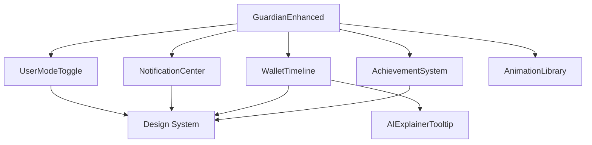

# Guardian UX Implementation Guide
## Complete Guide to Implementing World-Class Features

**Status**: Ready for Implementation  
**Last Updated**: October 25, 2025  
**Difficulty**: Intermediate to Advanced

---

## 📋 Table of Contents

1. [Overview](#overview)
2. [Prerequisites](#prerequisites)
3. [Component Architecture](#component-architecture)
4. [Implementation Steps](#implementation-steps)
5. [Integration Examples](#integration-examples)
6. [Testing Guidelines](#testing-guidelines)
7. [Troubleshooting](#troubleshooting)
8. [Performance Optimization](#performance-optimization)

---

## Overview

This guide walks you through implementing the enhanced Guardian UX features that transform the dashboard from a basic security tool into a world-class fintech product.

### What's Included

✅ **Design System**: Complete CSS variables and glassmorphism components  
✅ **AI Explainability**: Contextual tooltips and explanation modals  
✅ **Wallet Timeline**: Transaction history with search and filters  
✅ **Notifications**: Real-time alert system with categories  
✅ **Gamification**: Achievement badges and progress tracking  
✅ **User Modes**: Beginner/Expert toggle with adaptive UX  
✅ **Animations**: Motion design library with accessibility

---

## Prerequisites

### Required Dependencies

```bash
npm install framer-motion canvas-confetti lucide-react
npm install @radix-ui/react-tooltip @radix-ui/react-dialog
npm install @radix-ui/react-popover @radix-ui/react-scroll-area
```

### TypeScript Configuration

Ensure your `tsconfig.json` includes:

```json
{
  "compilerOptions": {
    "jsx": "react-jsx",
    "lib": ["ES2020", "DOM", "DOM.Iterable"],
    "moduleResolution": "bundler"
  }
}
```

### Tailwind CSS Setup

Add to your `tailwind.config.js`:

```js
module.exports = {
  theme: {
    extend: {
      animation: {
        'bounce-in': 'bounceIn 0.5s cubic-bezier(0.68, -0.55, 0.265, 1.55)',
        'fade-in': 'fadeIn 0.3s ease-out',
        'slide-in-right': 'slideInRight 0.3s ease-out',
      },
      keyframes: {
        bounceIn: {
          '0%': { opacity: '0', transform: 'scale(0.3)' },
          '50%': { opacity: '1', transform: 'scale(1.05)' },
          '70%': { transform: 'scale(0.9)' },
          '100%': { transform: 'scale(1)' },
        },
        fadeIn: {
          '0%': { opacity: '0', transform: 'translateY(10px)' },
          '100%': { opacity: '1', transform: 'translateY(0)' },
        },
        slideInRight: {
          '0%': { opacity: '0', transform: 'translateX(20px)' },
          '100%': { opacity: '1', transform: 'translateX(0)' },
        },
      },
    },
  },
};
```

---

## Component Architecture

### File Structure

```
src/
├── components/
│   └── guardian/
│       ├── AIExplainerTooltip.tsx          ← AI explanations
│       ├── NotificationCenter.tsx          ← Alerts & notifications
│       ├── WalletTimeline.tsx              ← Transaction history
│       ├── AchievementSystem.tsx           ← Gamification
│       ├── UserModeToggle.tsx              ← Beginner/Expert mode
│       └── AnimationLibrary.tsx            ← Reusable animations
├── styles/
│   └── guardian-design-system.css          ← Design tokens
└── pages/
    └── GuardianEnhanced.tsx                ← Main dashboard
```

### Component Dependencies



---

## Implementation Steps

### Step 1: Import Design System

Add to your main CSS file (e.g., `index.css` or `App.css`):

```css
@import './styles/guardian-design-system.css';
```

Or import in your main component:

```tsx
import '@/styles/guardian-design-system.css';
```

### Step 2: Set Up User Mode

Create a context for user mode (optional but recommended):

```tsx
// src/contexts/UserModeContext.tsx
import { createContext, useContext, ReactNode } from 'react';
import { useUserMode, UserMode } from '@/components/guardian/UserModeToggle';

interface UserModeContextType {
  mode: UserMode;
  setMode: (mode: UserMode) => void;
}

const UserModeContext = createContext<UserModeContextType | undefined>(undefined);

export function UserModeProvider({ children }: { children: ReactNode }) {
  const { mode, setMode } = useUserMode();
  
  return (
    <UserModeContext.Provider value={{ mode, setMode }}>
      {children}
    </UserModeContext.Provider>
  );
}

export function useUserModeContext() {
  const context = useContext(UserModeContext);
  if (!context) {
    throw new Error('useUserModeContext must be used within UserModeProvider');
  }
  return context;
}
```

### Step 3: Integrate Notifications

```tsx
// In your main Guardian page
import { NotificationCenter, useNotifications } from '@/components/guardian/NotificationCenter';

function GuardianPage() {
  const {
    notifications,
    addNotification,
    markAsRead,
    markAllAsRead,
    dismiss,
    clearAll,
  } = useNotifications();

  // Add notification when wallet scanned
  const handleScanComplete = (result: ScanResult) => {
    if (result.flags.length > 0) {
      addNotification({
        title: 'Security Alert',
        message: `Found ${result.flags.length} potential risks`,
        priority: 'important',
        category: 'security',
        actionLabel: 'View Details',
        onAction: () => {
          // Navigate to risks section
        },
      });
    }
  };

  return (
    <div>
      {/* Header with Notification Bell */}
      <header className="flex items-center justify-between p-4">
        <h1>Guardian</h1>
        <NotificationCenter
          notifications={notifications}
          onMarkAsRead={markAsRead}
          onMarkAllAsRead={markAllAsRead}
          onDismiss={dismiss}
          onClearAll={clearAll}
        />
      </header>
      
      {/* Rest of your page */}
    </div>
  );
}
```

### Step 4: Add AI Explainer Tooltips

Replace technical jargon with explainer tooltips:

```tsx
import { AIExplainerTooltip, GUARDIAN_EXPLAINERS } from '@/components/guardian/AIExplainerTooltip';

// Before:
<p>Trust Score: 87%</p>

// After:
<div className="flex items-center gap-2">
  <p>Trust Score: 87%</p>
  <AIExplainerTooltip {...GUARDIAN_EXPLAINERS.trustScore} />
</div>
```

Custom explanations:

```tsx
<AIExplainerTooltip
  concept="Gas Fees"
  simpleExplanation="The cost to process your transaction on the blockchain, like a processing fee."
  technicalExplanation="Gas is measured in Gwei (1 ETH = 1 billion Gwei). Total cost = Gas Used × Gas Price."
  analogy="Think of it like paying for postage - more urgent delivery costs more."
  learnMoreUrl="https://ethereum.org/en/developers/docs/gas/"
/>
```

### Step 5: Implement Wallet Timeline

```tsx
import { WalletTimeline, Transaction } from '@/components/guardian/WalletTimeline';

function TransactionHistoryPage() {
  const [transactions, setTransactions] = useState<Transaction[]>([]);
  
  // Fetch transactions from your API
  useEffect(() => {
    fetchTransactions(walletAddress).then(setTransactions);
  }, [walletAddress]);

  const handleExport = () => {
    // Export to CSV
    const csv = transactions.map(tx => 
      `${tx.timestamp},${tx.type},${tx.hash},${tx.amount},${tx.usdValue}`
    ).join('\n');
    
    const blob = new Blob([csv], { type: 'text/csv' });
    const url = URL.createObjectURL(blob);
    const a = document.createElement('a');
    a.href = url;
    a.download = 'transactions.csv';
    a.click();
  };

  return (
    <WalletTimeline
      transactions={transactions}
      walletAddress={walletAddress}
      onExport={handleExport}
      showAIInsights={true}
    />
  );
}
```

### Step 6: Add Gamification

```tsx
import { AchievementSystem, DEFAULT_ACHIEVEMENTS } from '@/components/guardian/AchievementSystem';

function ProfilePage() {
  const [achievements, setAchievements] = useState(() => {
    // Load from localStorage or API
    return DEFAULT_ACHIEVEMENTS.map(a => ({
      ...a,
      unlocked: false,
      unlockedAt: undefined,
      progress: 0,
    }));
  });

  const [userLevel, setUserLevel] = useState(1);
  const [userXP, setUserXP] = useState(0);
  const nextLevelXP = userLevel * 100;

  // Check for achievement unlocks
  useEffect(() => {
    checkAchievements();
  }, [scanCount, revokeCount, streak]);

  const checkAchievements = () => {
    setAchievements(prev => prev.map(achievement => {
      // Example: First scan achievement
      if (achievement.id === 'first_scan' && scanCount >= 1 && !achievement.unlocked) {
        return {
          ...achievement,
          unlocked: true,
          unlockedAt: new Date(),
          progress: 100,
        };
      }
      
      // Example: Revoke master achievement with progress
      if (achievement.id === 'revoke_master') {
        const progress = (revokeCount / achievement.requirement) * 100;
        return {
          ...achievement,
          progress: Math.min(progress, 100),
          unlocked: progress >= 100,
          unlockedAt: progress >= 100 ? new Date() : undefined,
        };
      }
      
      return achievement;
    }));
  };

  return (
    <AchievementSystem
      achievements={achievements}
      userLevel={userLevel}
      userXP={userXP}
      nextLevelXP={nextLevelXP}
      onAchievementClick={(achievement) => {
        console.log('Clicked achievement:', achievement);
      }}
    />
  );
}
```

### Step 7: Use Animations

```tsx
import { FadeIn, SlideIn, CountUp, ProgressCircle } from '@/components/guardian/AnimationLibrary';

function ScanResults({ trustScore }: { trustScore: number }) {
  return (
    <FadeIn>
      <div className="text-center">
        <ProgressCircle percentage={trustScore} />
        
        <h2 className="text-4xl font-bold mt-4">
          <CountUp to={trustScore} decimals={0} suffix="%" />
        </h2>
        
        <SlideIn direction="up" delay={0.2}>
          <p className="text-slate-400 mt-2">Trust Score</p>
        </SlideIn>
      </div>
    </FadeIn>
  );
}
```

---

## Integration Examples

### Full Dashboard Integration

```tsx
import { useState, useEffect } from 'react';
import { UserModeToggle, useUserMode } from '@/components/guardian/UserModeToggle';
import { NotificationCenter, useNotifications } from '@/components/guardian/NotificationCenter';
import { WalletTimeline } from '@/components/guardian/WalletTimeline';
import { AchievementSystem } from '@/components/guardian/AchievementSystem';
import { AIExplainerTooltip } from '@/components/guardian/AIExplainerTooltip';
import { FadeIn, SlideIn } from '@/components/guardian/AnimationLibrary';

export function EnhancedGuardianDashboard() {
  const { mode, setMode } = useUserMode();
  const notifications = useNotifications();
  const [scanResult, setScanResult] = useState(null);
  
  return (
    <div className="min-h-screen bg-gradient-to-br from-slate-900 via-slate-800 to-slate-900">
      {/* Header */}
      <header className="flex items-center justify-between p-6 border-b border-slate-700/50">
        <h1 className="text-2xl font-bold text-slate-100">Guardian</h1>
        
        <div className="flex items-center gap-4">
          <UserModeToggle mode={mode} onModeChange={setMode} />
          <NotificationCenter {...notifications} />
        </div>
      </header>

      {/* Main Content */}
      <main className="container mx-auto p-6 space-y-8">
        {/* Trust Score Card */}
        <FadeIn>
          <div className="guardian-glass-card p-8">
            <div className="flex items-center justify-between mb-4">
              <h2 className="text-xl font-semibold">Trust Score</h2>
              <AIExplainerTooltip
                concept="Trust Score"
                simpleExplanation="Your wallet's security rating from 0-100"
                showTechnical={mode === 'expert'}
              />
            </div>
            {/* Score display */}
          </div>
        </FadeIn>

        {/* Transaction Timeline */}
        <SlideIn direction="up" delay={0.2}>
          <WalletTimeline
            transactions={[]}
            walletAddress="0x..."
            showAIInsights={mode === 'beginner'}
          />
        </SlideIn>

        {/* Achievements (Expert mode only) */}
        {mode === 'expert' && (
          <SlideIn direction="up" delay={0.3}>
            <AchievementSystem
              achievements={[]}
              userLevel={1}
              userXP={0}
              nextLevelXP={100}
            />
          </SlideIn>
        )}
      </main>
    </div>
  );
}
```

---

## Testing Guidelines

### Unit Tests

```tsx
// src/components/guardian/__tests__/AIExplainerTooltip.test.tsx
import { render, screen } from '@testing-library/react';
import userEvent from '@testing-library/user-event';
import { AIExplainerTooltip } from '../AIExplainerTooltip';

describe('AIExplainerTooltip', () => {
  it('renders help icon', () => {
    render(
      <AIExplainerTooltip
        concept="Test"
        simpleExplanation="Simple explanation"
      />
    );
    
    expect(screen.getByRole('button')).toBeInTheDocument();
  });

  it('shows tooltip on hover', async () => {
    const user = userEvent.setup();
    render(
      <AIExplainerTooltip
        concept="Trust Score"
        simpleExplanation="Your wallet's security rating"
      />
    );
    
    const button = screen.getByRole('button');
    await user.hover(button);
    
    expect(screen.getByText(/Your wallet's security rating/i)).toBeInTheDocument();
  });
});
```

### Accessibility Tests

```tsx
import { axe } from 'jest-axe';

it('should not have accessibility violations', async () => {
  const { container } = render(<NotificationCenter {...props} />);
  const results = await axe(container);
  expect(results).toHaveNoViolations();
});
```

---

## Troubleshooting

### Common Issues

**Issue**: Animations not working
```tsx
// Solution: Check framer-motion installation
npm install framer-motion

// Ensure you're not in reduced motion mode
console.log(window.matchMedia('(prefers-reduced-motion: reduce)').matches);
```

**Issue**: Tooltips not appearing
```tsx
// Solution: Wrap app with TooltipProvider
import { TooltipProvider } from '@/components/ui/tooltip';

<TooltipProvider delayDuration={300}>
  <App />
</TooltipProvider>
```

**Issue**: CSS variables not working
```css
/* Solution: Import design system CSS first */
@import './styles/guardian-design-system.css';
@import 'tailwindcss/base';
@import 'tailwindcss/components';
@import 'tailwindcss/utilities';
```

---

## Performance Optimization

### Lazy Loading

```tsx
import { lazy, Suspense } from 'react';
import { Shimmer } from '@/components/guardian/AnimationLibrary';

const WalletTimeline = lazy(() => import('@/components/guardian/WalletTimeline'));

function App() {
  return (
    <Suspense fallback={<Shimmer height="400px" />}>
      <WalletTimeline transactions={[]} />
    </Suspense>
  );
}
```

### Memoization

```tsx
import { memo, useMemo } from 'react';

const TimelineItem = memo(({ transaction }: { transaction: Transaction }) => {
  return <div>{transaction.description}</div>;
});

function WalletTimeline({ transactions }: { transactions: Transaction[] }) {
  const filtered = useMemo(() => 
    transactions.filter(tx => tx.status === 'success'),
    [transactions]
  );
  
  return (
    <div>
      {filtered.map(tx => (
        <TimelineItem key={tx.id} transaction={tx} />
      ))}
    </div>
  );
}
```

---

## Next Steps

1. ✅ Review the [UX Redesign Roadmap](./GUARDIAN_UX_REDESIGN_ROADMAP.md)
2. ✅ Implement components step-by-step
3. ✅ Run tests and accessibility audits
4. ✅ Gather user feedback
5. ✅ Iterate and improve

---

**Need Help?**  
- 📖 [Design System Docs](./GUARDIAN_UX_REDESIGN_ROADMAP.md)
- 🎨 [Figma Design Files](#) (Coming soon)
- 💬 [Discord Community](#)

**Last Updated**: October 25, 2025  
**Maintainer**: Guardian UX Team

