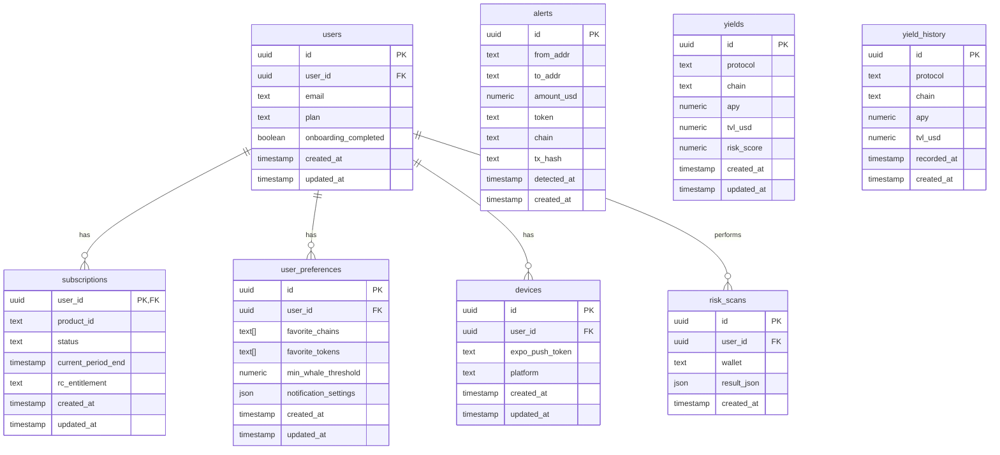

# Whale Tracker Application Architecture

## System Overview

## Component Architecture

## Database Schema

## API Architecture

## Security Architecture

## Deployment Architecture

## Data Flow Architecture

## Technology Stack

### Frontend
- **Framework**: React 18 with TypeScript
- **Build Tool**: Vite
- **UI Library**: shadcn/ui (Radix UI + Tailwind CSS)
- **State Management**: React Query + React Hooks
- **Routing**: React Router v6
- **Styling**: Tailwind CSS
- **Icons**: Lucide React

### Backend
- **Database**: Supabase PostgreSQL
- **Authentication**: Supabase Auth
- **API**: Supabase Edge Functions (Deno)
- **Real-time**: Supabase Realtime
- **File Storage**: Supabase Storage

### External Services
- **Payments**: Stripe
- **OAuth**: Google, Apple
- **Push Notifications**: Expo Push API
- **Blockchain Data**: Various APIs

### Development & Deployment
- **Version Control**: Git + GitHub
- **CI/CD**: GitHub Actions
- **Frontend Hosting**: Vercel/Netlify
- **Backend Hosting**: Supabase Cloud
- **Testing**: Jest + React Testing Library
- **Type Checking**: TypeScript
- **Linting**: ESLint + Prettier

### Security & Monitoring
- **Authentication**: JWT + OAuth 2.0
- **Database Security**: Row Level Security (RLS)
- **API Security**: CORS + Rate Limiting
- **Payment Security**: Stripe PCI Compliance
- **Monitoring**: Supabase Analytics + Sentry

This architecture provides a scalable, secure, and maintainable foundation for the whale tracking application with proper separation of concerns and modern development practices.